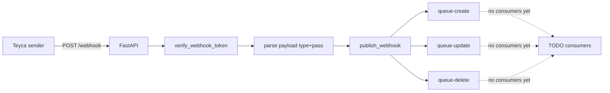
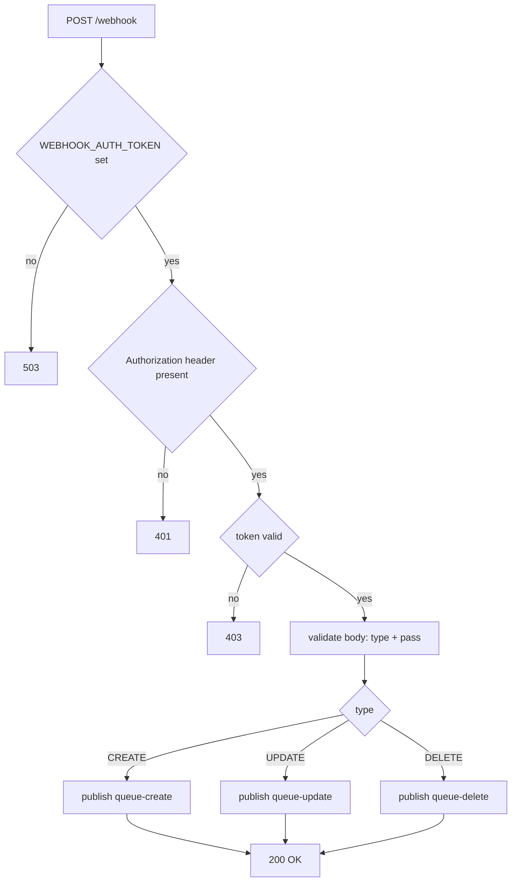
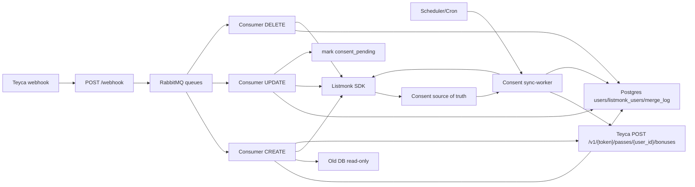
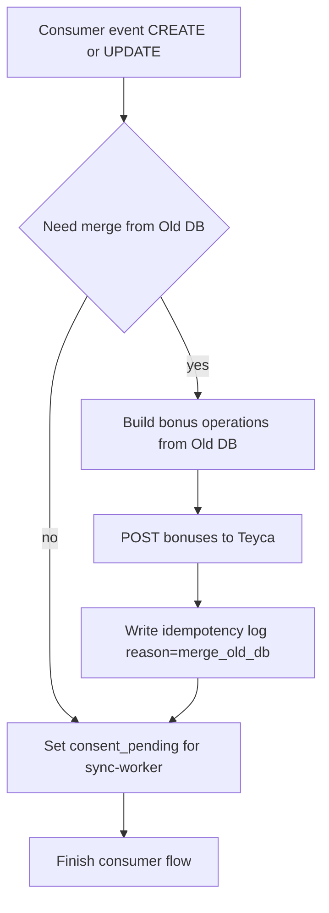
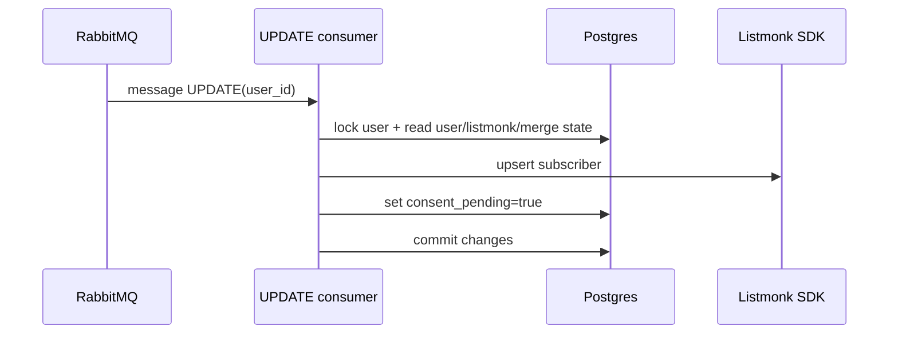
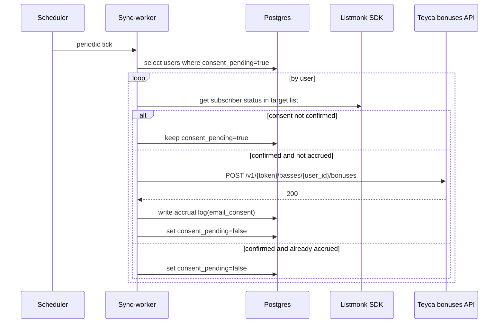

# Runtime Flow (Mermaid)

Источник:
- текущий код `app/` (факт)
- обновлённый `docs/roadmap.md` (целевая логика)

## 1) Текущее состояние (что уже работает)

## 2) Целевая схема по roadmap (после доработок)

## 3) Логика начислений бонусов (целевая)

## 4) Sequence: UPDATE без ожидания consent

## 5) Sequence: sync-worker для consent

