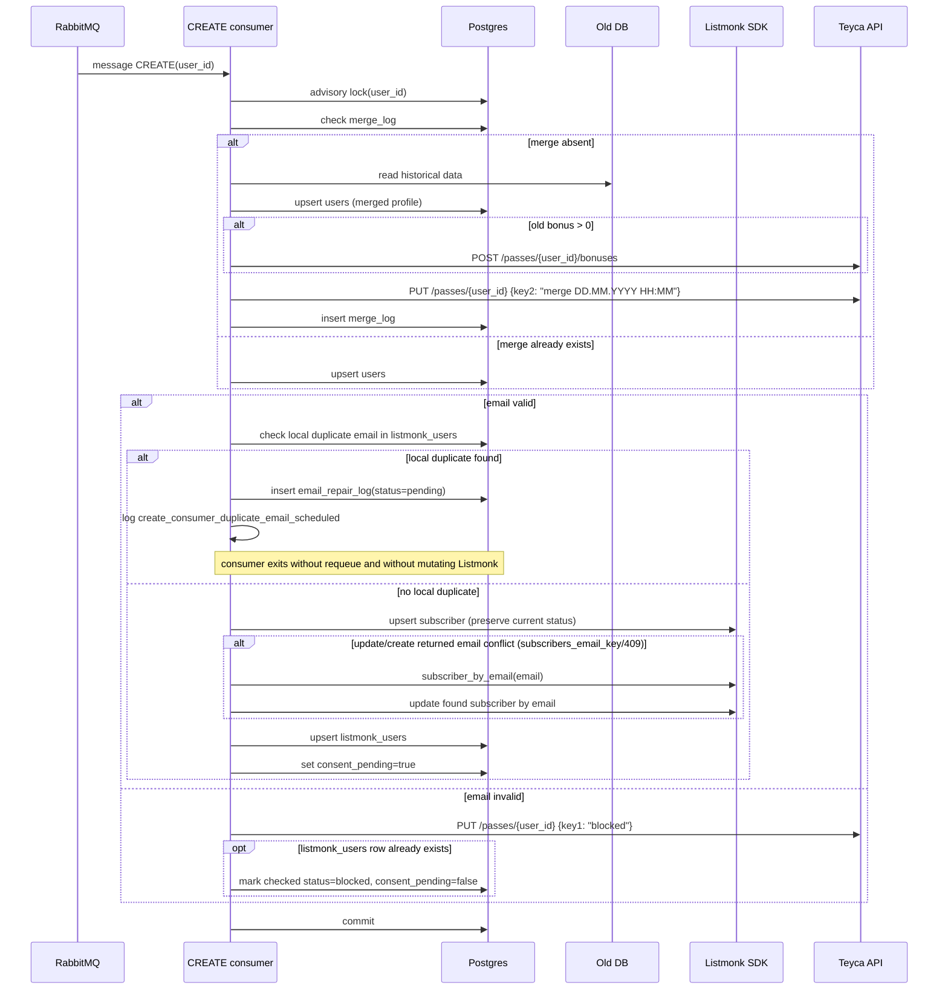
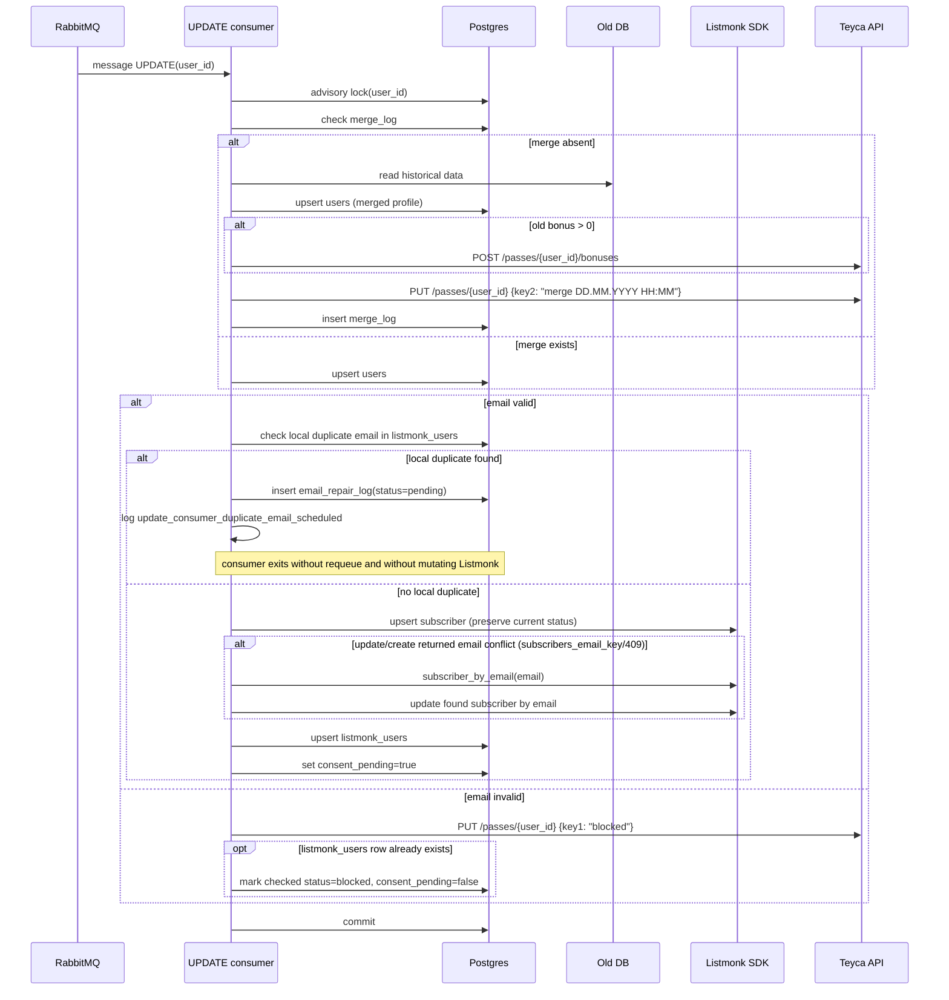
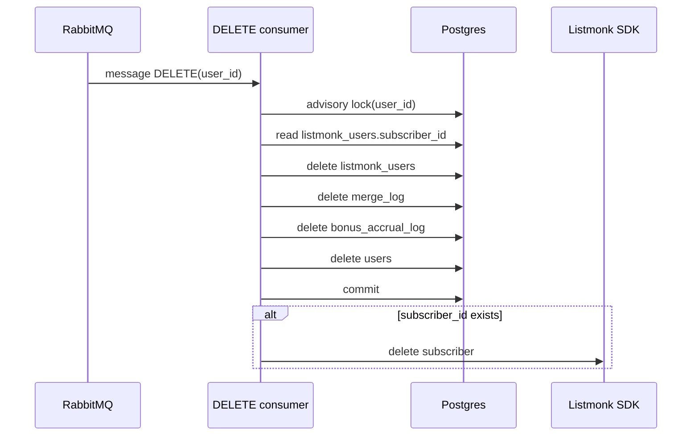
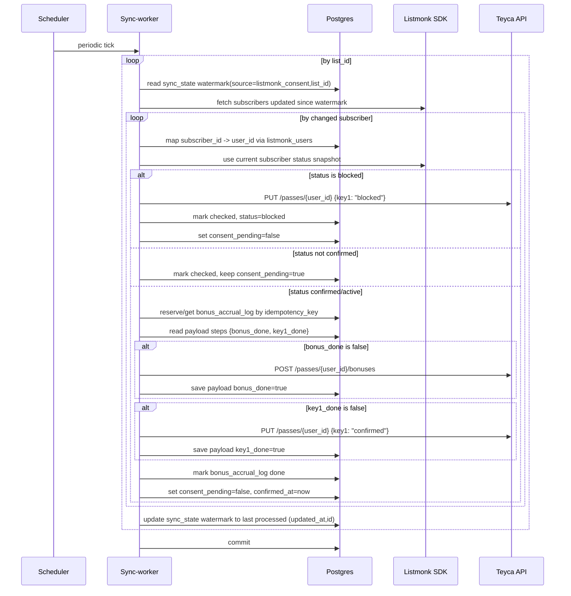
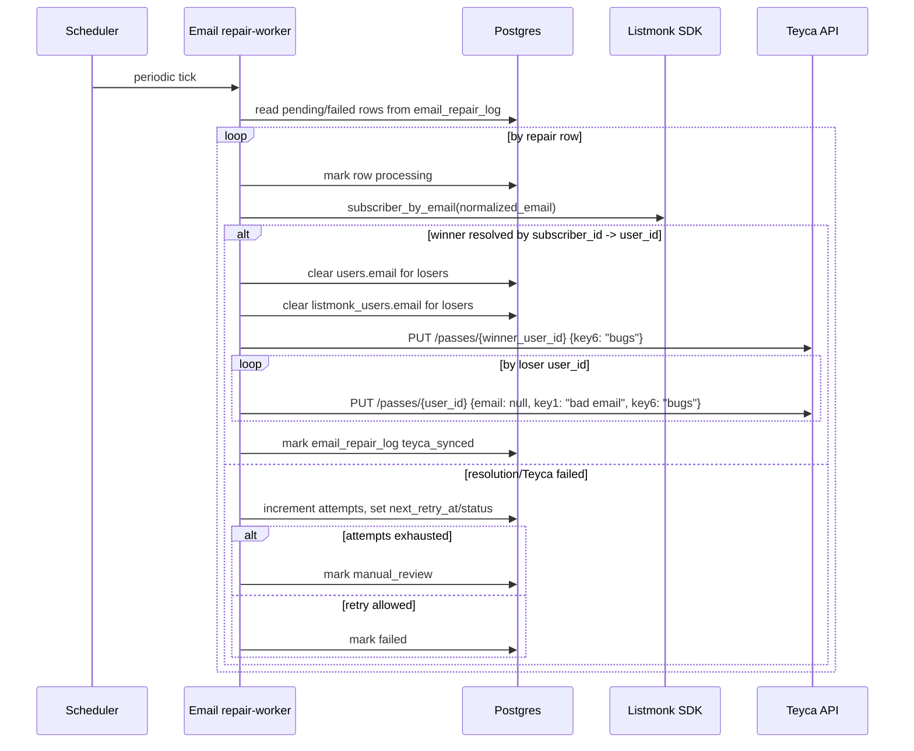
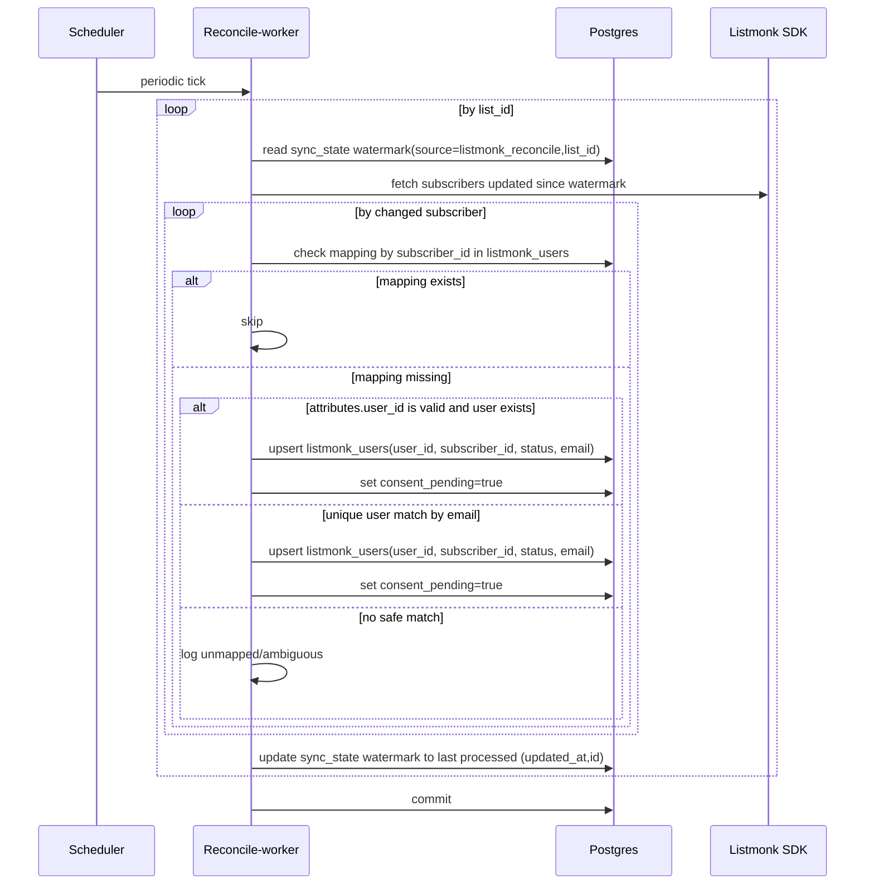

# Runtime Flow (Mermaid)

Источник:
- текущий код `app/` (факт на 2026-03-17)
- `docs/roadmap.md` (план/срезы)

## 1) Текущее состояние (реально в коде)

```mermaid
flowchart LR
    Teyca["Teyca sender"] -->|POST ${WEBHOOK}| API["FastAPI"]
    API --> Auth["verify_webhook_token (Authorization header)"]
    Auth --> Webhook["parse payload type+pass"]
    Webhook --> Pub["publish_webhook"]
    Pub --> Qc["queue-create"]
    Pub --> Qu["queue-update"]
    Pub --> Qd["queue-delete"]

    Qc --> CCreate["CREATE consumer"]
    Qu --> CUpdate["UPDATE consumer"]
    Qd --> CDelete["DELETE consumer"]

    CCreate --> PG["Postgres"]
    CUpdate --> PG
    CDelete --> PG

    CCreate --> LM["Listmonk SDK"]
    CUpdate --> LM
    CDelete --> LM

    CCreate --> TY["Teyca bonuses API"]
    CUpdate --> TY

    ER["email repair-worker"] --> PG
    ER --> LM
    ER --> TY

    SW["consent sync-worker"] --> PG
    SW --> LM
    SW --> TY

    RW["listmonk reconcile-worker"] --> PG
    RW --> LM
```

## 2) Sequence: CREATE



## 3) Sequence: UPDATE



## 4) Sequence: DELETE



## 5) Sequence: consent sync-worker



Примечание по текущему поведению Listmonk на 2026-03-18:
- найден баг в интеграции `app/clients/listmonk.py`: при обычном `UPDATE` мы вызываем SDK-метод `update_subscriber(...)`
- в используемой версии Python SDK этот метод всегда отправляет `preconfirm_subscriptions=true`
- следствие: повторный `UPDATE` может автоматически подтвердить подписку в double opt-in списке без действия клиента
- issue: `teyca-sync-b7j`

Примечание по delivery semantics:
- RabbitMQ consumer делает `ack` только после успешного завершения handler: см. `ConsumersRunner._callback`
- при любой ошибке до `ack` сообщение уходит в `reject(requeue=true)` или в delayed retry/dead-letter path для rate limit / lock contention
- это at-least-once обработка, а не exactly-once
- внешний вызов в Teyca/Listmonk может выполниться повторно, если процесс/соединение упадёт после внешнего side effect, но до `ack`
- для `consent_sync_worker` RabbitMQ не участвует; там повторяемость зависит от `bonus_accrual_log` и сохранённого step-progress
- `consent` бонус защищён частично: есть `idempotency_key=email_consent:{user_id}` и шаги `bonus_done/key1_done`, но если процесс упадёт после `POST /bonuses` и до `save_progress(bonus_done=true)`, повторное начисление всё ещё возможно
- `merge` бонусы в CREATE/UPDATE сейчас не имеют отдельного idempotency log, поэтому повторная доставка сообщения после внешнего начисления и до `ack` может привести к повторному начислению

## 6) Sequence: email repair-worker



## 7) Метрики и логи (runtime)

Подтверждённый контракт Teyca:

- `PUT /v1/{token}/passes/{user_id}` в живой системе ведёт себя как partial update.
- Проверка выполнена 2026-03-18 на тестовой карте `user_id=5722735`: запрос `PUT {"key6":"put-check"}` изменил только `key6`, остальные поля карты сохранились.

В конце каждого запуска `consent_sync_worker` пишется агрегированный лог:

- `event=consent_sync_metrics`
- `processed`
- `batch_size`
- `consent_bonus_amount`
- `deltas_fetched`
- `unmapped_subscribers`
- `subscriber_not_found`
- `blocked_done`
- `not_confirmed`
- `confirmed_done`
- `accrual_resumed`
- `operation_missing`
- `teyca_errors`

Дополнительные логи:
- `consent_sync_list_processed` — сколько deltas обработано по конкретному `list_id` и до какого watermark дошли.
- `consent_sync_subscriber_not_mapped` — в Listmonk есть subscriber, но нет связи с `user_id` в нашей БД.
- `listmonk_upsert_subscriber_request` / `listmonk_upsert_subscriber_done` — upsert subscriber в Listmonk (включая fallback по email при конфликте `subscribers_email_key`).
- `email_repair_metrics` — агрегированные счётчики запуска repair-worker.
- `email_repair_synced` — duplicate email разрешён и loser синхронизирован с Teyca.
- `email_repair_failed` — repair не завершился и переведён в `failed`/`manual_review`.

## 8) Sequence: listmonk reconcile-worker



Логи reconcile:
- `listmonk_reconcile_list_processed`
- `listmonk_reconcile_mapping_restored`
- `listmonk_reconcile_unmapped`
- `listmonk_reconcile_metrics` (агрегированные счётчики за запуск)
