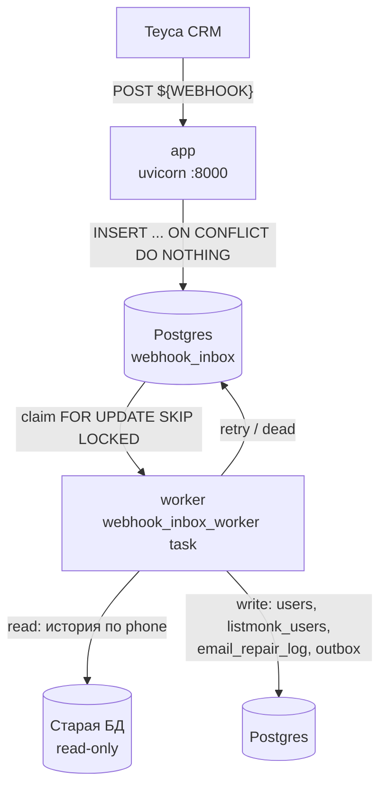
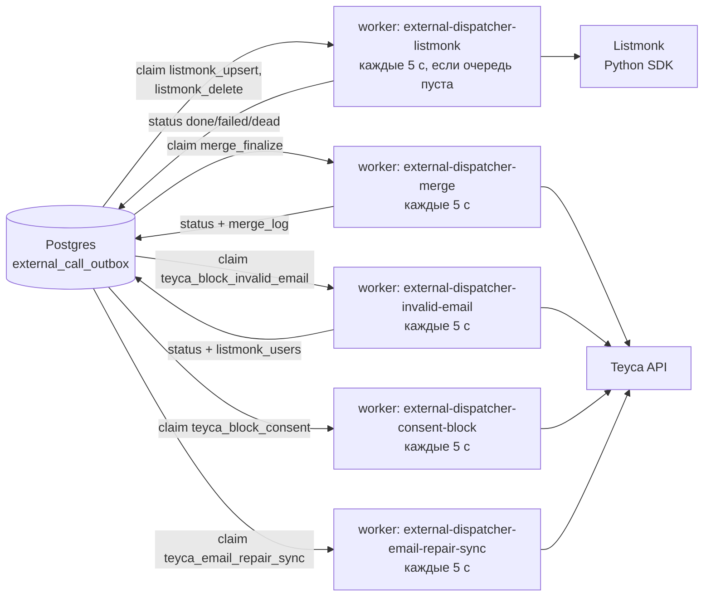
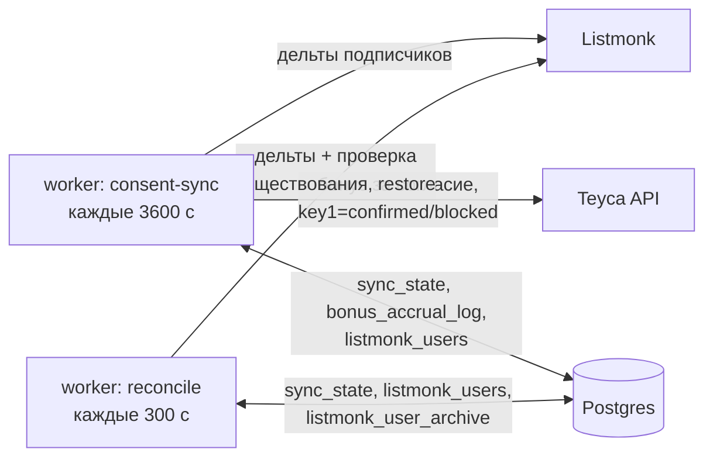
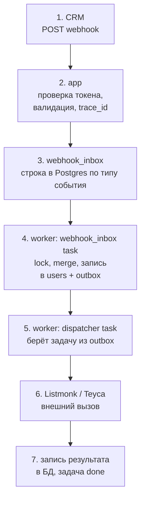
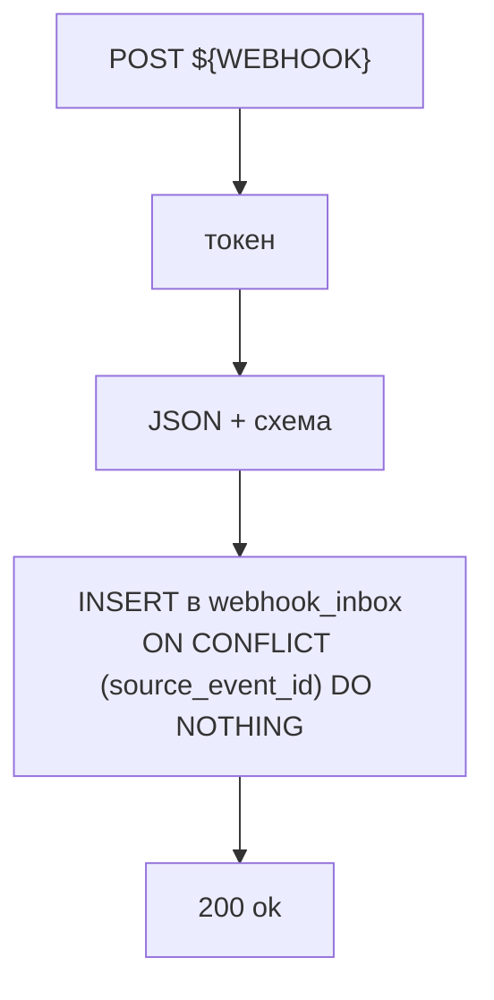
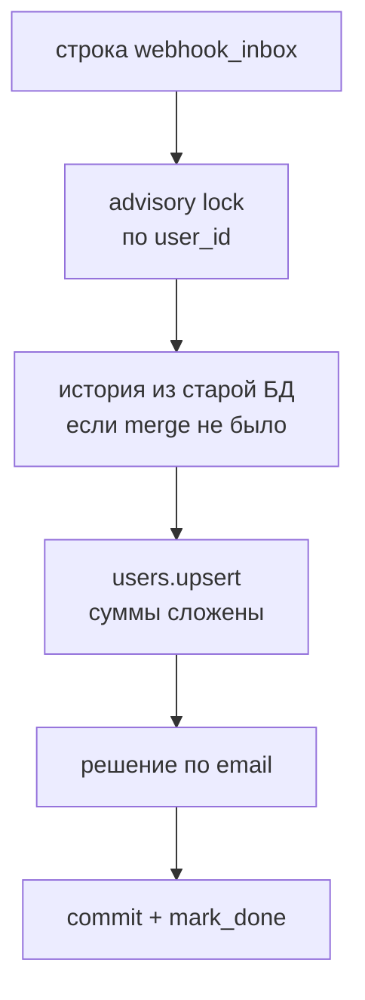
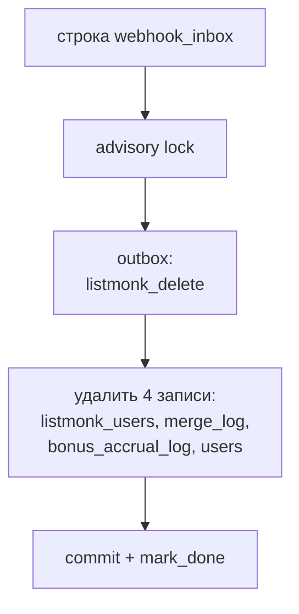
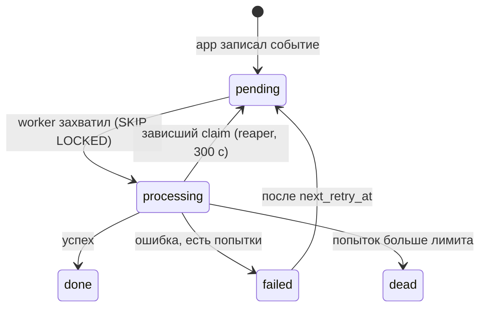
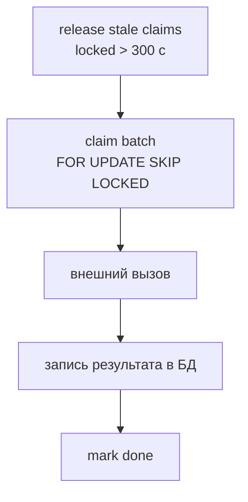
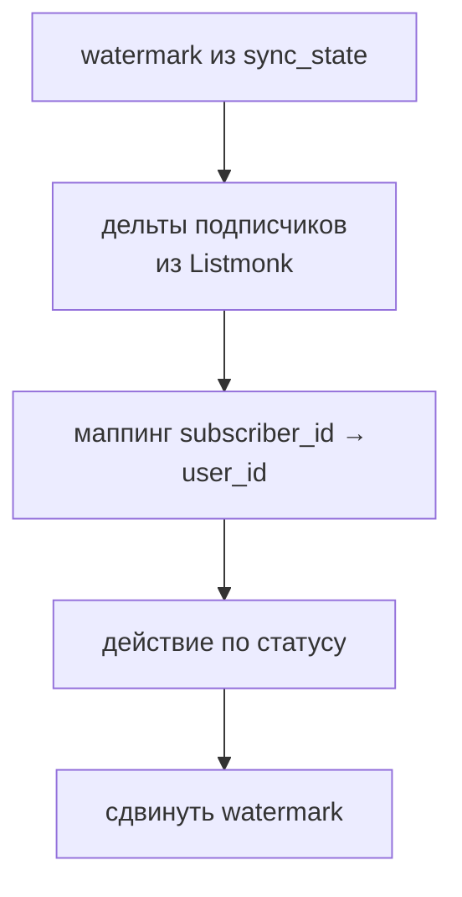

# Как работает teyca-sync

**Факт на 2026-08-07**, после teyca-sync-8ib (RabbitMQ → Postgres inbox) и
teyca-sync-2g7 (восемь процессов → один `worker`). Источник — код `app/` и
`compose.yaml`.

Документ рассчитан на чтение с нуля. Порядок: сначала «зачем это всё» и словарь терминов,
потом путь одного события целиком, потом каждый шаг подробно. Ссылки вида
`файл:строка` — где это в коде; при расхождении верить коду и править документ.

Диаграммы намеренно мелкие и линейные, ветвления вынесены в таблицы: одна большая схема
со всеми условиями нечитаема.

---

## 0) Что делает система

Сервис синхронизирует данные клиентов лояльности между тремя системами:

1. **Teyca CRM** — источник событий. При создании, изменении или удалении карты клиента
   присылает webhook.
2. **Listmonk** — рассыльщик email. Туда нужно заводить подписчика и оттуда узнавать,
   подтвердил ли клиент согласие на рассылку.
3. **Teyca API** — обратная запись в карту клиента: начисление бонусов и пометки в полях
   `key1`, `key2`.

Плюс **старая БД** (read-only): исторические суммы и визиты клиента, которые при первом
появлении клиента нужно один раз прибавить к текущим значениям.

Три бизнес-задачи, ради которых существует код:

- **Зеркалить профиль клиента** из CRM в свою БД и в Listmonk.
- **Один раз слить историю** из старой БД: сложить суммы, перенести бонусы в Teyca
  начислением, поставить метку `key2 = merge <дата>`.
- **Начислить бонус за согласие** на рассылку, когда клиент подтвердил подписку в Listmonk,
  и отразить статус согласия в поле `key1` карты Teyca.

Сервис заменяет прежний workflow в n8n.

### Словарь

| Термин | Что это |
|---|---|
| `user_id` | ключ клиента из CRM, он же PK в `users`, он же корреляция во всех системах |
| pass | карта лояльности в Teyca; события webhook приходят с полем `pass` |
| merge | разовое слияние истории из старой БД в профиль клиента; факт слияния — строка в `merge_log` |
| consent | согласие клиента на email-рассылку; источник истины — статус подписчика в Listmonk, не CRM |
| subscriber | подписчик в Listmonk; связь `user_id ↔ subscriber_id` хранится в `listmonk_users` |
| inbox | таблица `webhook_inbox`: очередь входящих webhook-событий в Postgres, заменяет RabbitMQ |
| outbox | таблица `external_call_outbox`: очередь внешних вызовов, которые надо сделать после коммита в БД |
| watermark | закладка «до какого места дочитали» в `sync_state` для инкрементальных сверок |
| dedupe_key | ключ идемпотентности строки outbox, например `merge-finalize:12345` |
| `key1` / `key2` | поля карты Teyca: `key1` — статус согласия (`confirmed` / `blocked` / `bad email`), `key2` — метка merge |

---

## 1) Из каких процессов состоит

Всего три compose-сервиса: `migrate` (одноразовый), `app` (FastAPI), `worker`
(все фоновые задачи одним процессом). Логи (оба сервиса пишут в Loki) на
схемах не показаны — см. раздел 11.

### 1.1 Приём события и запись в БД

```mermaid
flowchart TB
    CRM["Teyca CRM"] -->|"POST ${WEBHOOK}"| APP["app<br/>uvicorn :8000"]
    APP -->|"INSERT ... ON CONFLICT DO NOTHING"| INBOX[("Postgres<br/>webhook_inbox")]
    INBOX -->|"claim FOR UPDATE SKIP LOCKED"| WRK["worker<br/>webhook_inbox_worker task"]
    WRK -->|"retry / dead"| INBOX
    WRK -->|"read: история по phone"| ODB[("Старая БД<br/>read-only")]
    WRK -->|"write: users, listmonk_users,<br/>email_repair_log, outbox"| PG[("Postgres")]
```

Внешних вызовов на этом пути нет: `app` только пишет в `webhook_inbox`,
обработчики (`app/consumers/*`) только пишут в Postgres.

### 1.2 Выполнение внешних вызовов из outbox

```mermaid
flowchart LR
    PG[("Postgres<br/>external_call_outbox")]
    PG -->|"claim listmonk_upsert,<br/>listmonk_delete"| DLM["worker: external-dispatcher-listmonk<br/>каждые 5 c, если очередь пуста"]
    PG -->|"claim merge_finalize"| DMG["worker: external-dispatcher-merge<br/>каждые 5 c"]
    PG -->|"claim teyca_block_invalid_email"| DIE["worker: external-dispatcher-invalid-email<br/>каждые 5 c"]
    PG -->|"claim teyca_block_consent"| DCB["worker: external-dispatcher-consent-block<br/>каждые 5 c"]
    PG -->|"claim teyca_email_repair_sync"| DER["worker: external-dispatcher-email-repair-sync<br/>каждые 5 c"]
    DLM --> LM["Listmonk<br/>Python SDK"]
    DMG --> TY["Teyca API"]
    DIE --> TY
    DCB --> TY
    DER --> TY
    DLM -->|"status done/failed/dead"| PG
    DMG -->|"status + merge_log"| PG
    DIE -->|"status + listmonk_users"| PG
```

Пять веток claim'а — **один и тот же код** с разным набором операций
(`app/workers/run_worker.py`: пять вызовов `build_external_dispatcher_worker`
с разными `operations`). До teyca-sync-2g7 это было три отдельных
контейнера; сейчас — пять `ScheduledTask` внутри одного `worker`-процесса,
каждая крутит `ExternalDispatcherWorker.run_once()` в busy-loop, пока есть
работа, и засыпает на `external_dispatcher_poll_interval_seconds` (по
умолчанию 5с), когда очередь пуста.

### 1.3 Периодические сверки

```mermaid
flowchart LR
    CSY["worker: consent-sync<br/>каждые 3600 c"]
    REC["worker: reconcile<br/>каждые 300 c"]
    PG[("Postgres")]
    LM["Listmonk"]
    TY["Teyca API"]

    CSY -->|"дельты подписчиков"| LM
    CSY -->|"бонус за согласие,<br/>key1=confirmed/blocked"| TY
    CSY <-->|"sync_state, bonus_accrual_log,<br/>listmonk_users"| PG
    REC -->|"дельты + проверка<br/>существования, restore"| LM
    REC <-->|"sync_state, listmonk_users,<br/>listmonk_user_archive"| PG
```

Эти задачи **не используют outbox** — вызывают Listmonk и Teyca напрямую.
Интервалы — `consent_sync_interval_seconds` (3600 с) и
`listmonk_reconcile_interval_seconds` (300 с), настраиваются через `Settings`.

### 1.4 Восемь задач внутри одного процесса `worker`

| Задача (heartbeat-имя) | Интервал (пусто = busy-loop) | Postgres | Listmonk | Teyca | Старая БД |
|---|---|---|---|---|---|
| `consumers` (webhook_inbox) | `webhook_inbox_poll_interval_seconds` (1 с) | чтение+запись | — | — | чтение |
| `external-dispatcher-listmonk` | `external_dispatcher_poll_interval_seconds` (5 с) | чтение+запись | да | — | — |
| `external-dispatcher-merge` | 5 с | чтение+запись | — | да | — |
| `external-dispatcher-invalid-email` | 5 с | чтение+запись | — | да | — |
| `external-dispatcher-consent-block` | 5 с | чтение+запись | — | да | — |
| `external-dispatcher-email-repair-sync` | 5 с | чтение+запись | — | да | — |
| `consent-sync` | 3600 с | чтение+запись | да | да | — |
| `reconcile` | 300 с | чтение+запись | да | — | — |

Каждая задача — `ScheduledTask` (`app/workers/scheduled_task.py`), выполняется
`run_scheduled_task`: если `run_once()` вернул `processed > 0`, следующая
итерация запускается сразу (без сна); если `0` — задача спит до
`interval_seconds` или до `SIGTERM`. Все восемь задач запускаются
`asyncio.gather` в одном event loop (`app/workers/run_worker.py`); одна
задача, упавшая с исключением, не убивает остальные семь — исключение
логируется, heartbeat помечается `stage=failed`, следующая итерация той же
задачи выполняется по обычному расписанию (единственное сознательное
отличие от версии до teyca-sync-2g7).

Прочее:

- `app` и `migrate` не входят в список `ScheduledTask` — `app` обслуживает
  HTTP, `migrate` одноразовый и завершается до старта `worker`
  (`depends_on: migrate: condition: service_completed_successfully`).
- Healthcheck: у `app` — HTTP `/live`; у `worker` — агрегирующая проверка
  `app.service_health.all_worker_heartbeats_fresh()`, проверяющая свежесть
  всех восьми heartbeat-файлов из таблицы 1.4 с индивидуальными порогами
  (60с / 90с×5 / 4500с / 600с).
- Heartbeat-файлы (`<task>.json`) лежат в volume `heartbeat-data`,
  смонтированном в `/var/run/teyca-sync` у `app` и `worker` — читаются с
  хоста напрямую (`docker volume inspect heartbeat-data`), без
  `docker exec`.
- Postgres и старая БД — внешние, в `compose.yaml` их нет.
- Rate limit исходящих вызовов Teyca — бюджетная таблица `teyca_call_budget`
  в Postgres, без Redis (`app/clients/teyca.py` — `PostgresCallBudgetLimiter`).

---

## 2) Путь одного события целиком

Это главная схема документа: что происходит с одним webhook от CRM до внешних систем.

```mermaid
flowchart TB
    A["1. CRM<br/>POST webhook"] --> B["2. app<br/>проверка токена,<br/>валидация, trace_id"]
    B --> C["3. webhook_inbox<br/>строка в Postgres по типу события"]
    C --> D["4. worker: webhook_inbox task<br/>lock, merge, запись<br/>в users + outbox"]
    D --> E["5. worker: dispatcher task<br/>берёт задачу из outbox"]
    E --> F["6. Listmonk / Teyca<br/>внешний вызов"]
    F --> G["7. запись результата<br/>в БД, задача done"]
```

Ключевая идея архитектуры: **шаги 1–4 не делают внешних вызовов**. Обработчик коммитит в
Postgres и профиль клиента, и список внешних вызовов, которые нужно сделать. Поэтому
падение Listmonk или Teyca не ломает обработку события — задача просто ждёт в outbox.
Падение самого `worker`-процесса тоже не теряет события: `webhook_inbox` и
`external_call_outbox` — обычные таблицы, `pending`/`failed`/`processing`-строки
дожидаются перезапуска процесса.

Обратная сторона: между шагами 4 и 6 есть задержка (цикл dispatcher'а — до 5 секунд), и
внешние системы обновляются не в момент webhook'а, а асинхронно.

Отдельно от этого пути работают периодические сверки (раздел 7): они нужны там, где
инициатива не у CRM, а у Listmonk (клиент подтвердил подписку) или где надо починить
расхождение.

---

## 3) Шаг 2: приём webhook

Что делает `app`: проверяет токен, валидирует тело, присваивает событию `trace_id` и
записывает строку в `webhook_inbox`. Больше в БД на этом шаге ничего не пишется.

```mermaid
flowchart TB
    IN["POST ${WEBHOOK}"] --> AUTH["токен"] --> VAL["JSON + схема"] --> INS["INSERT в webhook_inbox<br/>ON CONFLICT (source_event_id) DO NOTHING"] --> OK["200 ok"]
```

Ответы:

| Ситуация | Ответ | Где |
|---|---|---|
| `WEBHOOK_AUTH_ENABLED=false` | проверка пропускается целиком | `app/api/auth.py:13` |
| `WEBHOOK_AUTH_TOKEN` не задан в конфиге | **503** «Webhook auth not configured» | `app/api/auth.py:16` |
| заголовок `Authorization` отсутствует | 401 | `app/api/auth.py:18` |
| токен не совпадает | 403 | `app/api/auth.py:22` |
| тело не парсится как JSON | 400 | `webhook.py` |
| клиент отвалился, не догрузив тело | 200 `{"ok": true}` | `webhook.py` |
| тело не проходит схему `WebhookPayload` | 422 | `webhook.py` |
| всё хорошо, новое событие | 200 `{"ok": true}` после `INSERT` | `webhook.py` |
| повторная доставка того же `source_event_id` | 200 `{"ok": true}`, строка не дублируется | `webhook.py` |
| Postgres недоступен | 500 (redeливери на стороне Teyca) — событие действительно не сохранилось, но других способов сохранить его тоже нет: если недоступна БД, недоступно вообще всё | `webhook.py` |

Маршрутизация по типу: `event_type` (`CREATE`/`UPDATE`/`DELETE`) сохраняется в
строке `webhook_inbox`, обработчик `worker`-задачи `consumers` решает, какой
из `app/consumers/{create,update,delete}_user.py` вызвать.

Что ещё важно:

- `trace_id` берётся из заголовка `X-Trace-Id` или генерируется; `source_event_id` — из
  `X-Event-Id` или генерируется. Оба сохраняются в строке `webhook_inbox`
  (`trace_id` колонкой, `source_event_id` — ключом идемпотентности) и дальше
  попадают в outbox и логи.
- Идемпотентность на входе: `source_event_id` — `UNIQUE` в `webhook_inbox`.
  Повторная доставка того же события — не ошибка, а no-op (`ON CONFLICT DO
  NOTHING`), ответ всё равно 200.
- Три эндпоинта здоровья отдают 503 при неготовности: `/live` (свежесть heartbeat
  `app`), `/ready` (доступность Postgres), `/health` (оба вместе).

---

## 4) Шаг 4: обработка события из webhook_inbox

Три обработчика (CREATE, UPDATE, DELETE) работают по одной канве. CREATE и UPDATE почти
идентичны, DELETE — отдельный короткий сценарий. Их вызывает
`webhook_inbox_worker.py` внутри задачи `consumers`, роутинг — по
`event_type` строки `webhook_inbox`.

### 4.1 CREATE и UPDATE

```mermaid
flowchart TB
    M["строка webhook_inbox"] --> L["advisory lock<br/>по user_id"] --> H["история из старой БД<br/>если merge не было"] --> U["users.upsert<br/>суммы сложены"] --> D["решение по email"] --> C["commit + mark_done"]
```

Решение по email — единственное ветвление, и от него зависит, что попадёт в outbox:

| Условие | Что делает обработчик | Что потом |
|---|---|---|
| email невалиден | `outbox: teyca_block_invalid_email` | dispatcher поставит `key1 = blocked` в Teyca |
| email валиден, но занят другим `user_id` (гонка на уникальном индексе `users.email`) | `IntegrityError` перехватывается в той же транзакции, `app/consumers/email_conflict.py` разрешает конфликт по детерминированной Р5/Р6-политике и ставит `outbox: teyca_email_repair_sync` | dispatcher синхронизирует победителя/проигравшего с Teyca (см. 6.1) |
| email валиден и свободен | `outbox: listmonk_upsert` | dispatcher создаст/обновит подписчика |

Независимо от email, если история из старой БД есть и `merge_log` пуст, добавляется
`outbox: merge_finalize` — начисление старых бонусов и метка `key2`.

Правила слияния (`app/consumers/common.py`):

- Суммы `summ`, `summ_all`, `summ_last`, `check_summ` и визиты `visits`, `visits_all`
  **складываются** с историческими значениями.
- Признак «merge уже был» — наличие строки в `merge_log`. Проверяется дважды: до взятия
  блокировки (чтобы решить, читать ли старую БД) и после.
- В `merge_log` пишет **не обработчик**, а dispatcher — только после успешных вызовов Teyca.

Отличия UPDATE от CREATE: если в payload не пришло поле `tags`, текущие теги сохраняются
из БД. Всё остальное совпадает.

### 4.2 DELETE

```mermaid
flowchart TB
    M["строка webhook_inbox"] --> L["advisory lock"] --> Q["outbox:<br/>listmonk_delete"] --> R["удалить 4 записи:<br/>listmonk_users, merge_log,<br/>bonus_accrual_log, users"] --> C["commit + mark_done"]
```

Задача на удаление подписчика ставится **до** удаления строк, в той же транзакции, и несёт
`subscriber_id` в payload — поэтому dispatcher сможет её выполнить, когда пользователя уже
не будет в БД.

### 4.3 Что гарантирует обработка

- Профиль клиента и список внешних вызовов коммитятся одной транзакцией: side effect не
  может «потеряться» при падении до коммита.
- Параллельная обработка одного `user_id` исключена advisory lock'ом; занятый lock — не
  ошибка, а повод отложить строку (раздел 5).
- Обработка **at-least-once**: строка помечается `done` только после успешного `handle` и
  коммита. Повторная обработка возможна (после падения процесса — см. `release_stale_processing_claims`),
  поэтому идемпотентность держится на `dedupe_key` в outbox и на `merge_log`.

---

## 5) Retry и dead: webhook_inbox

Место RabbitMQ-очередей с парами `-retry`/`-dead` занимает состояние строки
`webhook_inbox` (`app/repositories/webhook_inbox.py`), тот же приём, что и у
`external_call_outbox` (раздел 6).

```mermaid
stateDiagram-v2
    [*] --> pending: app записал событие
    pending --> processing: worker захватил (SKIP LOCKED)
    processing --> done: успех
    processing --> failed: ошибка, есть попытки
    failed --> pending: после next_retry_at
    processing --> dead: попыток больше лимита
    processing --> pending: зависший claim (reaper, 300 c)
```

| Класс ошибки | Что происходит | Лимит |
|---|---|---|
| `UserLockNotAcquiredError` (другой процесс держит lock) | `mark_retry` с backoff по `webhook_inbox_lock_busy_retry_*` | `webhook_inbox_lock_busy_retry_max_retries` = 5 |
| `TeycaAPIError` со статусом 429 | `mark_retry` с backoff по `webhook_inbox_teyca_rate_limit_retry_*` (база 60 с) | `webhook_inbox_teyca_rate_limit_retry_max_retries` = 10 |
| Любая другая ошибка | `mark_retry` с общим backoff `webhook_inbox_retry_*` | `webhook_inbox_max_retries` = 25 |

Формула backoff — общая для `webhook_inbox` и `external_call_outbox`
(`app/retry_backoff.py`, `base * 2^(n-1)`, capped at `max_delay_ms`), больше
не дублируется по коду (до teyca-sync-8ib было три независимые копии).

Ещё по обработке:

- Параллелизм ограничен `webhook_inbox_max_concurrency` и ёмкостью пула БД —
  семафор не даёт исчерпать пул соединений.
- `wait_for_lock`: если строка уже была в работе (`attempts > 0`), повторная
  попытка ждёт advisory lock вместо мгновенного отказа — семантика
  сохранена с версии на RabbitMQ, только вместо заголовка сообщения
  используется счётчик `attempts` строки.

---

## 6) Шаги 5–7: outbox и dispatcher

### 6.1 Что лежит в outbox

Таблица `external_call_outbox`, одна строка на пару «операция + клиент», уникальность по
`dedupe_key` (`app/db/models.py`).

| Операция | Кто ставит | Что делает dispatcher | Семантика |
|---|---|---|---|
| `listmonk_upsert` | CREATE / UPDATE | создать или обновить подписчика, записать `subscriber_id` и статус в `listmonk_users`, выставить `consent_pending = true` | «последнее желаемое состояние»: новая строка затирает прежнюю (`enqueue_latest`) |
| `listmonk_delete` | DELETE | удалить подписчика по `subscriber_id` из payload | «один раз» (`enqueue_once`) |
| `teyca_block_invalid_email` | CREATE / UPDATE при невалидном email | `PUT /passes/{user_id} {key1: "blocked"}`, пометить `listmonk_users` | «последнее желаемое состояние» |
| `merge_finalize` | CREATE / UPDATE при первом merge | начислить старые бонусы, поставить `key2 = merge <дата>`, записать `merge_log` | «один раз» |
| `teyca_block_consent` | consent-sync при отзыве подписки | `PUT /passes/{user_id} {key1: "blocked"}` | «последнее желаемое состояние» |
| `teyca_email_repair_sync` | `app/consumers/email_conflict.py` при гонке на `users.email` | синхронизировать победителя/проигравшего с Teyca, разобрать дубликат | «последнее желаемое состояние» |

`dedupe_key` строится хелперами `dedupe_key_for_*` в
`app/repositories/external_call_outbox.py`, например
`listmonk-sync:{user_id}`, `merge-finalize:{user_id}`,
`email-repair-sync:{repair_id}`.

### 6.2 Как dispatcher обрабатывает задачу

```mermaid
flowchart TB
    S["release stale claims<br/>locked > 300 c"] --> CL["claim batch<br/>FOR UPDATE SKIP LOCKED"] --> EX["внешний вызов"] --> W["запись результата в БД"] --> DN["mark done"]
```

Состояния строки:

```mermaid
stateDiagram-v2
    [*] --> pending: событие поставило задачу
    pending --> processing: dispatcher захватил
    processing --> done: успех
    processing --> failed: ошибка, есть попытки
    failed --> processing: после next_retry_at
    processing --> dead: попыток больше 25
    processing --> pending: rate limit или зависший claim
    done --> pending: новое событие с тем же dedupe_key
```

Обработка ошибок (`external_dispatcher_worker.py`):

| Ошибка | Действие | Расход попытки |
|---|---|---|
| `TeycaRateLimitBusyError` | `defer`: `next_retry_at = now + wait_seconds` | нет |
| `ListmonkClientError`, `TeycaAPIError`, `httpx.HTTPError`, `RuntimeError` | `mark_retry` с экспоненциальным backoff; при 25 попытках → `dead` | да |
| Любая другая | **не перехватывается**, вылетает из `run_once`; строка висит в `processing` до reaper'а (300 с). В отличие от версии до teyca-sync-2g7, само это исключение больше не убивает процесс — только эту итерацию текущей задачи внутри `run_worker` | нет |

Многошаговая операция `merge_finalize` защищена от повторов внутри себя: после каждого
успешного вызова Teyca прогресс сохраняется флагами `bonus_done` / `key2_done` в payload.
При повторе выполнится только незавершённый шаг.

Отдельная особенность: если при записи `listmonk_users` обнаружен дубликат
`subscriber_id` или email, ошибка перехватывается внутри, задача всё равно
закрывается как `done`, но маппинг не обновлён — расхождение с Listmonk остаётся до
reconcile или ручного воркера.

---

## 7) Периодические сверки

### 7.1 consent-sync (каждые 3600 с) — бонус за согласие

Зачем: CRM не знает, подтвердил ли клиент подписку. Источник истины — Listmonk, а webhook
от Listmonk сознательно не используется, вместо него опрос по закладке.

```mermaid
flowchart TB
    W["watermark из sync_state"] --> D["дельты подписчиков<br/>из Listmonk"] --> M["маппинг subscriber_id → user_id"] --> A["действие по статусу"] --> NW["сдвинуть watermark"]
```

| Статус подписчика | Действие |
|---|---|
| `blocked` / `blocklisted` или blocked в целевом списке | `key1 = blocked` в Teyca, `consent_pending = false` |
| не подтверждён | отметить проверку, `consent_pending` остаётся `true` |
| `confirmed` / `active` | начислить бонус (`POST /bonuses`), поставить `key1 = confirmed`, снять `consent_pending`, записать `consent_confirmed_at` |

Идемпотентность начисления — таблица `bonus_accrual_log`: ключ
`email_consent:{user_id}` плюс пошаговые флаги `bonus_done` / `key1_done`.
Остаточный риск двойного начисления — падение процесса между вызовом Teyca и сохранением
флага.

Важная деталь: задача обрабатывает **все** маппинги из дельт, без фильтра по
`consent_pending`.

### 7.2 reconcile (каждые 300 с) — восстановление связи с Listmonk

Делает две несвязанные вещи за один запуск.

**Фаза 1 — новые/изменённые подписчики без маппинга.** Читает дельты по каждому `list_id`
и пытается связать подписчика с `user_id`:

| Способ связать | Условие |
|---|---|
| по `attributes.user_id` | значение валидно и такой пользователь есть в `users` |
| по email | email даёт **единственное** совпадение в `users` |
| не связывать | иначе — лог `unmapped` / `ambiguous` |

**Фаза 2 — consistency scan** (`listmonk_reconcile_worker.py`): круговой обход
`listmonk_users`, проверка, что подписчик всё ещё существует в Listmonk. Если исчез —
`restore_subscriber` создаёт нового, старая строка уходит в `listmonk_user_archive`.
Ошибка Listmonk внутри фазы делает `break`: остаток батча ждёт следующего тика.

### 7.3 Разбор дубликатов email — в реальном времени, не отдельный воркер

До teyca-sync-4wh/eh8 конфликт email между двумя `user_id` разбирался
отдельным (не запущенным нигде) `email_repair_worker.py`. Сейчас
`users.email` защищён уникальным индексом на уровне БД; конфликт ловится
как `IntegrityError` прямо в CREATE/UPDATE-обработчике
(`app/consumers/email_conflict.py`) и разрешается той же транзакцией: тот
же детерминированный Р5/Р6-порядок победителя/проигравшего, что раньше
использовался для одноразовой чистки, но теперь применяется на лету и
ставит `outbox: teyca_email_repair_sync` — драйнится задачей
`external-dispatcher-email-repair-sync` (раздел 6.1).

`email_repair_log` при этом остаётся: пишется как журнал уже разрешённых
конфликтов, а не как очередь ожидающих обработки строк.

---

## 8) Воркеры, которые есть в коде, но не в расписании `worker`

| Модуль | Как запускается | Что делает |
|---|---|---|
| `service_workers/run_email_repair_backfill.py` | вручную | разовый backfill дубликатов, оставшихся с до-`email_conflict.py` времён |
| `service_workers/run_listmonk_duplicate_subscriber.py` | вручную, `README.md` | чистка дублей `subscriber_id` |
| `service_workers/run_listmonk_refresh_subscriber_ids.py` | `make listmonk-refresh-subscriber-ids[-apply]` | пересчёт `subscriber_id` по email |
| `app/workers/run_external_dispatcher.py` | `make external-dispatcher-once` | все операции outbox сразу, для ручной прогонки/отладки (в `worker` разбит на пять параллельных задач) |
| `app/workers/run_webhook_inbox_consumer.py`, `run_consent_sync.py`, `run_listmonk_reconcile.py`, пять `run_external_dispatcher_*.py` | `make consumers` / `make consent-sync-once` / `make reconcile-once` / `make external-dispatcher-*-once` | однократные (или самозацикленные — `run_webhook_inbox_consumer.py`) entrypoint'ы той же бизнес-логики, для ручного запуска/отладки одной задачи в изоляции; `worker` их не вызывает, использует `build_*_worker()` напрямую |

Разовые/лечебные воркеры (`service_workers/`) вынесены из `app/`, чтобы не тянуть за собой
app-scoped quality-гейты (coverage, complexity, docstring coverage, dead-code, security) —
они не работают в проде на постоянной основе. `legacy_snapshot_importer.py` и его раннер
удалены совсем: импорт снапшота старой БД выполнен (teyca-sync-x3g).

---

## 9) Известные слабые места

Собрано по коду, без предположений о продакшене:

1. ~~**Потеря события на входе.**~~ Исправлено (teyca-sync-8ib): событие
   пишется в Postgres (`webhook_inbox`) в том же запросе, что и валидация;
   независимого брокера, который мог бы упасть отдельно от БД, больше нет.
2. ~~**Бесконечный requeue / нет лимита попыток.**~~ Исправлено
   (teyca-sync-9lv, унаследовано `webhook_inbox`): `webhook_inbox_max_retries`
   переводит строку в `dead` вместо бесконечных повторов.
3. **Зависшие claim'ы в outbox/inbox.** Непойманное исключение оставляет строку в `processing`
   на 5 минут; вернуть её может только reaper (`release_stale_processing_claims`).
4. **Дубликаты закрываются как `done`** без обновления маппинга (Listmonk upsert).
5. **Двойное начисление в узком окне.** И `merge_finalize`, и consent-бонус защищены
   пошаговыми флагами, но падение между вызовом Teyca и сохранением флага не покрыто.
6. **Обрыв consistency scan** по `break` при первой ошибке Listmonk (reconcile, фаза 2).
7. ~~**Три копии формулы backoff.**~~ Исправлено (teyca-sync-8ib): общая
   `app/retry_backoff.py`, переиспользуется `webhook_inbox` и
   `external_call_outbox`.
8. ~~**Heartbeat виден только внутри контейнера.**~~ Исправлено
   (teyca-sync-2g7): именованный volume `heartbeat-data`, читается с хоста
   без `docker exec`.

---

## 10) Контракты внешних систем

**Teyca API:**

- `PUT /v1/{token}/passes/{user_id}` — **partial update**. Проверено 2026-03-18 на карте
  `user_id=5722735`: `PUT {"key6":"put-check"}` изменил только `key6`, остальное сохранилось.
- `POST /v1/{token}/passes/{user_id}/bonuses` — начисление операциями; используется и для
  merge-бонусов, и для consent-бонуса. Через `PUT` бонусы не начисляются.
- Клиент повторяет транзиентные ошибки и 5xx (`teyca_request_max_retries` = 2), таймауты
  задаются `teyca_connect/read/write/pool_timeout_seconds`.
- 429 поднимается как `TeycaAPIError.is_rate_limited`; в dispatcher'е это `defer`, в
  `webhook_inbox`-обработке — `mark_retry` с большими задержками (раздел 5).
- Свой rate limiter: бюджетная таблица `teyca_call_budget` в Postgres (секунда/минута/час/сутки),
  реальные лимиты 5/50/500/5000. Исчерпание не блокирует воркер — вызов
  сразу падает `TeycaRateLimitBusyError`, claim откладывается (`defer`, с потолком попыток).
- Circuit breaker (`app/circuit_breaker.py`): после `teyca_circuit_breaker_failure_threshold`
  (5) подряд неудач вызовы отклоняются без реального HTTP-запроса на
  `teyca_circuit_breaker_cooldown_seconds` (30 с), затем один пробный вызов
  решает, закрыть breaker или снова открыть. Проверено
  `tests/integration/test_teyca_fault_injection.py`.

**Listmonk (только через Python SDK, прямые HTTP-вызовы запрещены):**

- `upsert_subscriber` без `subscriber_id` создаёт подписчика; при конфликте `409` /
  `subscribers_email_key` переключается на обновление по email.
- Если сохранённый `subscriber_id` больше не существует, подписчик пересоздаётся по email.
- При обновлении текущий статус подписчика передаётся явно. Прежний риск
  авто-подтверждения подписки через `preconfirm_subscriptions=true` (issue `teyca-sync-b7j`)
  относится к внутренностям SDK и требует перепроверки на текущей версии.
- `list_id` берётся из `LISTMONK_LIST_IDS`, а не из CRM.
- Тот же circuit breaker, свои пороги: `listmonk_circuit_breaker_failure_threshold`
  (5), `listmonk_circuit_breaker_cooldown_seconds` (30 с). Проверено
  `tests/integration/test_listmonk_fault_injection.py`.

**Postgres:**

- Единственная общая точка отказа для входящего пути (`webhook_inbox`) и
  всех фоновых задач `worker`. Проверено
  `tests/integration/test_postgres_unavailable.py`: операция с БД падает
  быстро (connection refused, не зависает до таймаута), а `ScheduledTask`
  переживает разрыв соединения — логирует ошибку и продолжает по
  расписанию, не роняя остальные семь задач в процессе.

---

## 11) Логи по компонентам

Во всех логах обработки есть `trace_id`, `source_event_id`, `user_id`:
через `structlog.contextvars` в `webhook_inbox_worker.py` и
`external_dispatcher_worker.py`. У периодических задач `trace_id`
синтетический, например `consent-sync:{user_id}:{subscriber_id}` — с
исходным webhook-событием он не связан.

| Компонент | События |
|---|---|
| Приём (`app`) | `webhook_received`, `webhook_invalid_json`, `webhook_validation_failed`, `webhook_client_disconnected`, `webhook_duplicate_event` |
| `worker`: webhook_inbox | `webhook_inbox_metrics`, `webhook_inbox_stale_claims_released`, `webhook_inbox_user_lock_busy`, `webhook_inbox_teyca_error_retry_scheduled`, `webhook_inbox_job_retry_scheduled` |
| `worker`: dispatcher | `external_dispatcher_metrics`, `external_dispatcher_no_pending_jobs`, `external_dispatcher_stale_claims_released`, `external_dispatcher_job_retry_scheduled`, `external_dispatcher_job_rate_limit_deferred`, `external_dispatcher_listmonk_upsert_done`, `external_dispatcher_listmonk_delete_done`, `external_dispatcher_invalid_email_block_done`, `external_dispatcher_merge_finalize_done`, `external_dispatcher_duplicate_*` |
| `worker`: consent-sync | `consent_sync_metrics`, `consent_sync_list_processed`, `consent_sync_subscriber_not_mapped`, `consent_sync_subscriber_not_found` |
| `worker`: reconcile | `listmonk_reconcile_metrics`, `listmonk_reconcile_list_processed`, `listmonk_reconcile_mapping_restored`, `listmonk_reconcile_unmapped`, `listmonk_reconcile_subscriber_restored`, `listmonk_reconcile_state_check_failed`, `listmonk_reconcile_restore_failed` |
| Клиенты | `listmonk_upsert_subscriber_request`, `listmonk_upsert_subscriber_done`, `teyca_request_retry`, `teyca_circuit_breaker_open`, `listmonk_circuit_breaker_open` |
| Инфраструктура | `health_check_failed`, `service_heartbeat_write_failed`, `scheduled_task_run_failed`, `worker_started`, `worker_shutdown_signal_received`, `worker_shutdown_drain_timeout` |

---

## 12) Что изменилось с версии документа от 2026-07-30

| Было | Стало |
|---|---|
| Транспорт входящего webhook — RabbitMQ (`queue-create/update/delete` + retry/dead пары) | Postgres-таблица `webhook_inbox`, `FOR UPDATE SKIP LOCKED`, состояние в самой строке |
| 8 процессов (`app`, `rabbitmq`, `consumers`, три `external-dispatcher-*`, `consent-sync`, `reconcile`) | 3 процесса (`migrate`, `app`, `worker`); внутри `worker` — восемь `ScheduledTask` в одном event loop |
| Интервалы (5с/60с/300с) заданы shell-циклом в `command:` compose-сервиса | Интервалы — поля `Settings` (`external_dispatcher_poll_interval_seconds` и т.д.), логика — `run_scheduled_task` |
| Одна упавшая задача может уронить весь свой контейнер, перезапускается shell-циклом или `restart: unless-stopped` | Одна упавшая задача не убивает остальные семь в общем процессе — исключение ловится внутри `run_scheduled_task` |
| Heartbeat виден только `docker exec` | Heartbeat на volume, читается с хоста |
| Email-конфликт — отдельная таблица `email_repair_log(pending)`, разбирающий воркер не запущен | Конфликт ловится как `IntegrityError` в реальном времени в CREATE/UPDATE, разрешается `email_conflict.py` в той же транзакции |
| Три независимые копии формулы backoff | Одна общая `app/retry_backoff.py` |

Более старая история изменений (переход на outbox/dispatcher-архитектуру,
до RabbitMQ-миграции) — в `docs/roadmap.md` и `docs/reverse-engineering-plan.md`.
