# Как работает teyca-sync

**Факт на 2026-07-30**, коммит `5541ba8`. Источник — код `app/` и `compose.yaml`.

Документ рассчитан на чтение с нуля. Порядок: сначала «зачем это всё» и словарь терминов,
потом путь одного события целиком, потом каждый шаг подробно. Ссылки вида
`файл:строка` — где это в коде; при расхождении верить коду и править документ.

Диаграммы намеренно мелкие и линейные, ветвления вынесены в таблицы: одна большая схема
со всеми условиями нечитаема.

---

## 0) Что делает система

Сервис синхронизирует данные клиентов лояльности между тремя системами:

1. **Teyca CRM** — источник событий. При создании, изменении или удалении карты клиента
   присылает webhook.
2. **Listmonk** — рассыльщик email. Туда нужно заводить подписчика и оттуда узнавать,
   подтвердил ли клиент согласие на рассылку.
3. **Teyca API** — обратная запись в карту клиента: начисление бонусов и пометки в полях
   `key1`, `key2`.

Плюс **старая БД** (read-only): исторические суммы и визиты клиента, которые при первом
появлении клиента нужно один раз прибавить к текущим значениям.

Три бизнес-задачи, ради которых существует код:

- **Зеркалить профиль клиента** из CRM в свою БД и в Listmonk.
- **Один раз слить историю** из старой БД: сложить суммы, перенести бонусы в Teyca
  начислением, поставить метку `key2 = merge <дата>`.
- **Начислить бонус за согласие** на рассылку, когда клиент подтвердил подписку в Listmonk,
  и отразить статус согласия в поле `key1` карты Teyca.

Сервис заменяет прежний workflow в n8n.

### Словарь

| Термин | Что это |
|---|---|
| `user_id` | ключ клиента из CRM, он же PK в `users`, он же корреляция во всех системах |
| pass | карта лояльности в Teyca; события webhook приходят с полем `pass` |
| merge | разовое слияние истории из старой БД в профиль клиента; факт слияния — строка в `merge_log` |
| consent | согласие клиента на email-рассылку; источник истины — статус подписчика в Listmonk, не CRM |
| subscriber | подписчик в Listmonk; связь `user_id ↔ subscriber_id` хранится в `listmonk_users` |
| outbox | таблица `external_call_outbox`: очередь внешних вызовов, которые надо сделать после коммита в БД |
| watermark | закладка «до какого места дочитали» в `sync_state` для инкрементальных сверок |
| dedupe_key | ключ идемпотентности строки outbox, например `merge-finalize:12345` |
| `key1` / `key2` | поля карты Teyca: `key1` — статус согласия (`confirmed` / `blocked` / `bad email`), `key2` — метка merge |

---

## 1) Из каких процессов состоит

Три схемы по путям данных вместо одной общей. Логи (все процессы пишут в Loki) и Redis
(rate limiter Teyca) на схемах не показаны — они в таблице 1.4.

### 1.1 Приём события и запись в БД

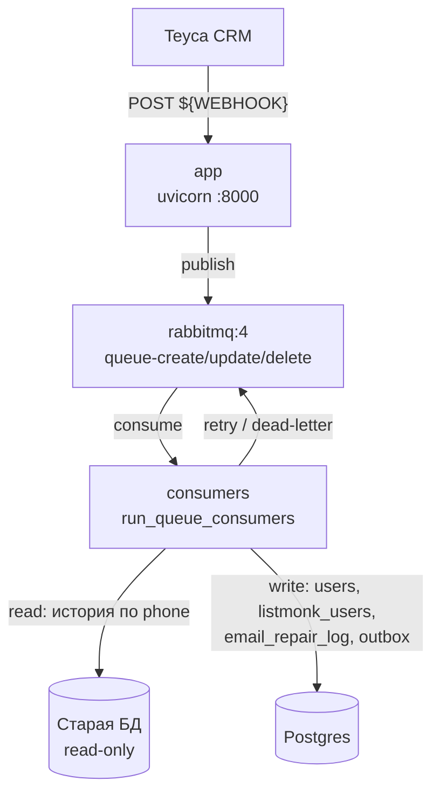
```mermaid
flowchart TB
    CRM["Teyca CRM"] -->|"POST ${WEBHOOK}"| APP["app<br/>uvicorn :8000"]
    APP -->|"publish"| RMQ["rabbitmq:4<br/>queue-create/update/delete"]
    RMQ -->|"consume"| CONS["consumers<br/>run_queue_consumers"]
    CONS -->|"retry / dead-letter"| RMQ
    CONS -->|"read: история по phone"| ODB[("Старая БД<br/>read-only")]
    CONS -->|"write: users, listmonk_users,<br/>email_repair_log, outbox"| PG[("Postgres")]
```

Внешних вызовов на этом пути нет: consumer только пишет в Postgres.

### 1.2 Выполнение внешних вызовов из outbox

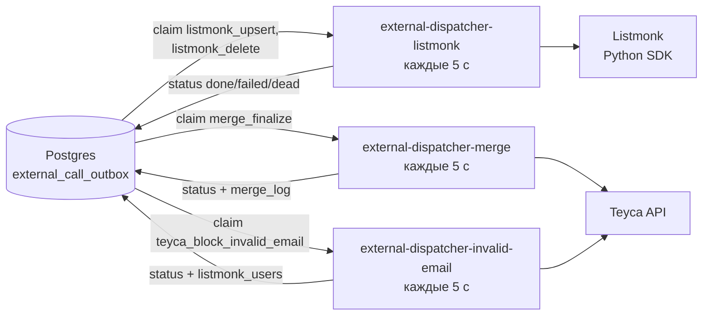
```mermaid
flowchart LR
    PG[("Postgres<br/>external_call_outbox")]
    PG -->|"claim listmonk_upsert,<br/>listmonk_delete"| DLM["external-dispatcher-listmonk<br/>каждые 5 c"]
    PG -->|"claim merge_finalize"| DMG["external-dispatcher-merge<br/>каждые 5 c"]
    PG -->|"claim teyca_block_invalid_email"| DIE["external-dispatcher-invalid-email<br/>каждые 5 c"]
    DLM --> LM["Listmonk<br/>Python SDK"]
    DMG --> TY["Teyca API"]
    DIE --> TY
    DLM -->|"status done/failed/dead"| PG
    DMG -->|"status + merge_log"| PG
    DIE -->|"status + listmonk_users"| PG
```

Три контейнера — **один и тот же код** с разным набором операций
(`run_external_dispatcher_listmonk.py:10`, `_merge.py:10`, `_invalid_email.py:10`).

### 1.3 Периодические сверки

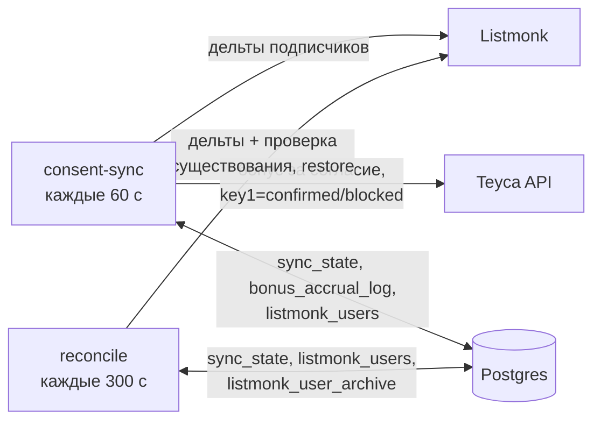
```mermaid
flowchart LR
    CSY["consent-sync<br/>каждые 60 c"]
    REC["reconcile<br/>каждые 300 c"]
    PG[("Postgres")]
    LM["Listmonk"]
    TY["Teyca API"]

    CSY -->|"дельты подписчиков"| LM
    CSY -->|"бонус за согласие,<br/>key1=confirmed/blocked"| TY
    CSY <-->|"sync_state, bonus_accrual_log,<br/>listmonk_users"| PG
    REC -->|"дельты + проверка<br/>существования, restore"| LM
    REC <-->|"sync_state, listmonk_users,<br/>listmonk_user_archive"| PG
```

Эти воркеры **не используют outbox** — вызывают Listmonk и Teyca напрямую.

### 1.4 Зависимости процессов

| Процесс | Расписание | Postgres | RabbitMQ | Listmonk | Teyca | Старая БД |
|---|---|---|---|---|---|---|
| `migrate` | one-shot при старте | запись схемы | — | — | — | — |
| `app` | постоянно | только `/ready` | publish | — | — | — |
| `consumers` | постоянно | чтение+запись | consume+retry | — | — | чтение |
| `external-dispatcher-listmonk` | цикл 5 c | чтение+запись | — | да | — | — |
| `external-dispatcher-merge` | цикл 5 c | чтение+запись | — | — | да | — |
| `external-dispatcher-invalid-email` | цикл 5 c | чтение+запись | — | — | да | — |
| `consent-sync` | цикл 60 c | чтение+запись | — | да | да | — |
| `reconcile` | цикл 300 c | чтение+запись | — | да | — | — |

¹ `consumers` создаёт клиентов Listmonk и Teyca (`run_queue_consumers.py:573-574`) и передаёт их
в `ConsumersRunner`, но поля `listmonk_client` / `teyca_client` нигде не читаются (`:70-71`) —
мёртвая зависимость от прежней архитектуры.

Прочее:

- Периодичность задана не планировщиком, а shell-циклом в команде контейнера:
  `while true; do python -m ...; sleep N; done` (`compose.yaml:79`, `:101`, `:123`, `:145`, `:170`).
- Redis больше не используется (teyca-sync-3al): лимит исходящих вызовов Teyca — бюджетная
  таблица `teyca_call_budget` в Postgres (`app/clients/teyca.py` — `PostgresCallBudgetLimiter`).
- Healthcheck: у `app` — HTTP `/live`, у остальных — свежесть файлового heartbeat
  (`app/service_health.py:14`). Heartbeat лежит в ФС контейнера, снаружи не виден.
- Postgres и старая БД внешние, в `compose.yaml` их нет.

---

## 2) Путь одного события целиком

Это главная схема документа: что происходит с одним webhook от CRM до внешних систем.

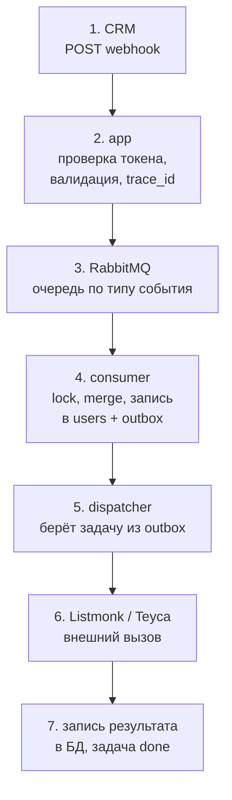
```mermaid
flowchart TB
    A["1. CRM<br/>POST webhook"] --> B["2. app<br/>проверка токена,<br/>валидация, trace_id"]
    B --> C["3. RabbitMQ<br/>очередь по типу события"]
    C --> D["4. consumer<br/>lock, merge, запись<br/>в users + outbox"]
    D --> E["5. dispatcher<br/>берёт задачу из outbox"]
    E --> F["6. Listmonk / Teyca<br/>внешний вызов"]
    F --> G["7. запись результата<br/>в БД, задача done"]
```

Ключевая идея архитектуры: **шаги 1–4 не делают внешних вызовов**. Consumer коммитит в
Postgres и профиль клиента, и список внешних вызовов, которые нужно сделать. Поэтому
падение Listmonk или Teyca не ломает обработку события — задача просто ждёт в outbox.

Обратная сторона: между шагами 4 и 6 есть задержка (цикл dispatcher'а — 5 секунд), и
внешние системы обновляются не в момент webhook'а, а асинхронно.

Отдельно от этого пути работают периодические сверки (раздел 6): они нужны там, где
инициатива не у CRM, а у Listmonk (клиент подтвердил подписку) или где надо починить
расхождение.

---

## 3) Шаг 2: приём webhook

Что делает `app`: проверяет токен, валидирует тело, присваивает событию `trace_id` и
кладёт в очередь по типу. В БД на этом шаге ничего не пишется.

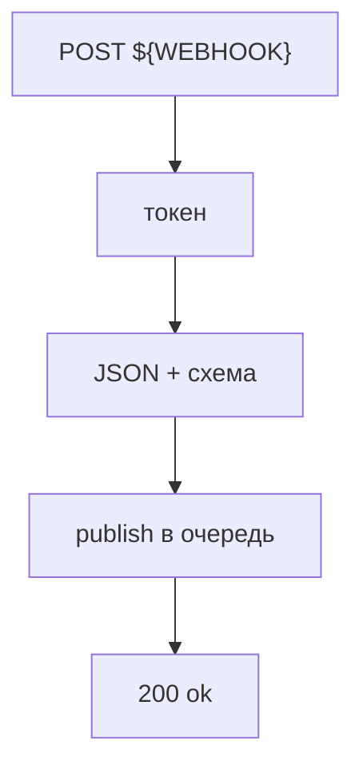
```mermaid
flowchart TB
    IN["POST ${WEBHOOK}"] --> AUTH["токен"] --> VAL["JSON + схема"] --> PUB["publish в очередь"] --> OK["200 ok"]
```

Ответы:

| Ситуация | Ответ | Где |
|---|---|---|
| `WEBHOOK_AUTH_ENABLED=false` | проверка пропускается целиком | `app/api/auth.py:13` |
| `WEBHOOK_AUTH_TOKEN` не задан в конфиге | **503** «Webhook auth not configured» | `app/api/auth.py:16` |
| заголовок `Authorization` отсутствует | 401 | `app/api/auth.py:18` |
| токен не совпадает | 403 | `app/api/auth.py:22` |
| тело не парсится как JSON | 400 | `webhook.py:122` |
| клиент отвалился, не догрузив тело | 200 `{"ok": true}` | `webhook.py:108` |
| тело не проходит схему `WebhookPayload` | 422 | `webhook.py:136` |
| всё хорошо | 200 `{"ok": true}` после publish | `webhook.py:149` |
| RabbitMQ недоступен | 500, **событие потеряно** | там же |

Маршрутизация: `CREATE → queue-create`, `UPDATE → queue-update`, `DELETE → queue-delete`
(`app/mq/publisher.py:74`). Имена очередей — только из констант `app/mq/queues.py`.

Что ещё важно:

- `trace_id` берётся из заголовка `X-Trace-Id` или генерируется; `source_event_id` — из
  `X-Event-Id` или генерируется (`webhook.py:153-160`). Оба попадают в тело сообщения, в
  `correlation_id` / `message_id` сообщения RabbitMQ и дальше в outbox и логи.
- Очередь объявляется лениво при первой публикации; при ошибке канала кэш объявлений
  сбрасывается, чтобы не работать с мёртвым каналом (`publisher.py:52-55`).
- Буфера на входе нет: если брокер недоступен, событие не сохраняется нигде.
- Три эндпоинта здоровья отдают 503 при неготовности: `/live` (свежесть heartbeat),
  `/ready` (Postgres + RabbitMQ), `/health` (оба вместе) — `webhook.py:35-94`.

---

## 4) Шаг 4: consumer

Три consumer'а (CREATE, UPDATE, DELETE) работают по одной канве. CREATE и UPDATE почти
идентичны, DELETE — отдельный короткий сценарий.

### 4.1 CREATE и UPDATE

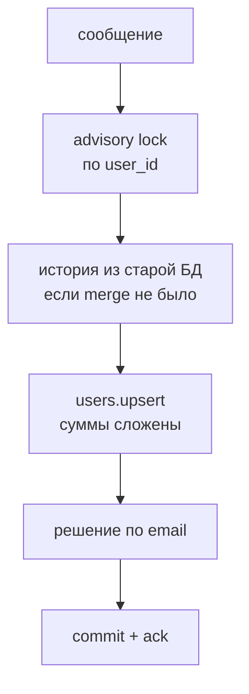
```mermaid
flowchart TB
    M["сообщение"] --> L["advisory lock<br/>по user_id"] --> H["история из старой БД<br/>если merge не было"] --> U["users.upsert<br/>суммы сложены"] --> D["решение по email"] --> C["commit + ack"]
```

Решение по email — единственное ветвление, и от него зависит, что попадёт в outbox:

| Условие | Что делает consumer | Что потом |
|---|---|---|
| email невалиден | `outbox: teyca_block_invalid_email` | dispatcher поставит `key1 = blocked` в Teyca |
| email валиден, но занят другим `user_id` | строка `email_repair_log(pending)` | ждёт email-repair воркера — **он не запущен**, см. 6.3 |
| email валиден и свободен | `outbox: listmonk_upsert` | dispatcher создаст/обновит подписчика |

Независимо от email, если история из старой БД есть и `merge_log` пуст, добавляется
`outbox: merge_finalize` — начисление старых бонусов и метка `key2`.

Правила слияния (`app/consumers/common.py`):

- Суммы `summ`, `summ_all`, `summ_last`, `check_summ` и визиты `visits`, `visits_all`
  **складываются** с историческими значениями.
- Признак «merge уже был» — наличие строки в `merge_log`. Проверяется дважды: до взятия
  блокировки (чтобы решить, читать ли старую БД) и после.
- В `merge_log` пишет **не consumer**, а dispatcher — только после успешных вызовов Teyca.

Отличия UPDATE от CREATE: если в payload не пришло поле `tags`, текущие теги сохраняются
из БД (`update_user.py:126`). Всё остальное совпадает.

### 4.2 DELETE

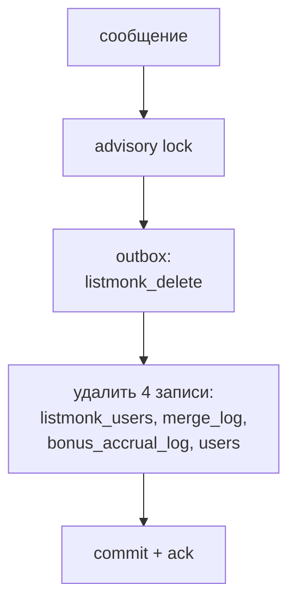
```mermaid
flowchart TB
    M["сообщение"] --> L["advisory lock"] --> Q["outbox:<br/>listmonk_delete"] --> R["удалить 4 записи:<br/>listmonk_users, merge_log,<br/>bonus_accrual_log, users"] --> C["commit + ack"]
```

Задача на удаление подписчика ставится **до** удаления строк, в той же транзакции, и несёт
`subscriber_id` в payload — поэтому dispatcher сможет её выполнить, когда пользователя уже
не будет в БД.

### 4.3 Что гарантирует consumer

- Профиль клиента и список внешних вызовов коммитятся одной транзакцией: side effect не
  может «потеряться» при падении до коммита.
- Параллельная обработка одного `user_id` исключена advisory lock'ом; занятый lock — не
  ошибка, а повод отложить сообщение (раздел 5).
- Обработка **at-least-once**: `ack` только после успешного `handle` и коммита
  (`run_queue_consumers.py:319-334`). Повторная доставка возможна, поэтому идемпотентность
  держится на `dedupe_key` в outbox и на `merge_log`.

---

## 5) Транспорт: повторы и dead-letter

У каждой основной очереди есть пара `-retry` и `-dead` (`app/mq/queues.py:7-12`).
Механика задержки: сообщение публикуется в `-retry` с TTL, по истечении TTL брокер
дедлеттерит его обратно в основную очередь (`run_queue_consumers.py:439-465`).

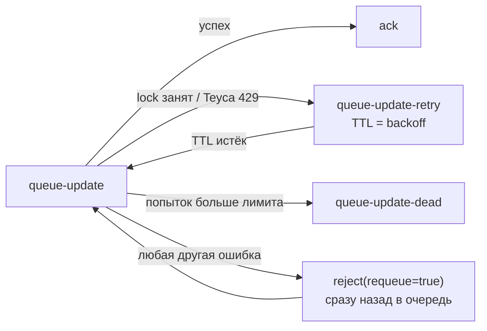
```mermaid
flowchart LR
    Q["queue-update"] -->|"успех"| ACK["ack"]
    Q -->|"lock занят / Teyca 429"| R["queue-update-retry<br/>TTL = backoff"]
    R -->|"TTL истёк"| Q
    Q -->|"попыток больше лимита"| DEAD["queue-update-dead"]
    Q -->|"любая другая ошибка"| RQ["reject(requeue=true)<br/>сразу назад в очередь"]
    RQ --> Q
```

| Класс ошибки | Что происходит | Лимит |
|---|---|---|
| `UserLockNotAcquiredError` (другой процесс держит lock) | в `-retry` с экспоненциальным backoff, после лимита — в `-dead` | `RABBITMQ_LOCK_BUSY_RETRY_MAX_RETRIES` = 5 |
| `TeycaAPIError` со статусом 429 | то же, но с большими задержками (база 60 с) | `RABBITMQ_TEYCA_RATE_LIMIT_RETRY_MAX_RETRIES` = 10 |
| Любая другая ошибка | `reject(requeue=true)` — немедленный возврат в ту же очередь | ограничения нет² |

² Единственный ограничитель — аргумент очереди `x-max-delivery-count`, а он выставляется
только при `RABBITMQ_MAIN_QUEUE_MAX_DELIVERY_COUNT > 0`; **по умолчанию 0**
(`app/config.py:27`, применение — `run_queue_consumers.py:416-428`). То есть битое сообщение
крутится в очереди бесконечно, нагружая БД и логи.

Ещё по транспорту:

- Параллелизм = минимум из `prefetch_count`, `RABBITMQ_CONSUMER_MAX_CONCURRENCY` и ёмкости
  пула БД (`run_queue_consumers.py:400-413`) — семафор не даёт исчерпать пул соединений.
- Класс 429 в consumer'е сейчас недостижим на практике: consumer больше не вызывает Teyca.
  Ветка осталась от прежней архитектуры.
- Константа `QUEUE_MERGE = "queue-request-to-merge"` объявлена (`app/mq/queues.py:6`), но
  никем не публикуется и не читается — мёртвая сущность.

---

## 6) Шаги 5–7: outbox и dispatcher

### 6.1 Что лежит в outbox

Таблица `external_call_outbox`, одна строка на пару «операция + клиент», уникальность по
`dedupe_key` (`app/db/models.py:208`).

| Операция | Кто ставит | Что делает dispatcher | Семантика |
|---|---|---|---|
| `listmonk_upsert` | CREATE / UPDATE | создать или обновить подписчика, записать `subscriber_id` и статус в `listmonk_users`, выставить `consent_pending = true` | «последнее желаемое состояние»: новая строка затирает прежнюю (`enqueue_latest`) |
| `listmonk_delete` | DELETE | удалить подписчика по `subscriber_id` из payload | «один раз» (`enqueue_once`) |
| `teyca_block_invalid_email` | CREATE / UPDATE при невалидном email | `PUT /passes/{user_id} {key1: "blocked"}`, пометить `listmonk_users` | «последнее желаемое состояние» |
| `merge_finalize` | CREATE / UPDATE при первом merge | начислить старые бонусы, поставить `key2 = merge <дата>`, записать `merge_log` | «один раз» |

`dedupe_key` — это `listmonk-sync:{user_id}`, `listmonk-delete:{user_id}`,
`invalid-email-block:{user_id}`, `merge-finalize:{user_id}` (`external_call_outbox.py:27-40`).

### 6.2 Как dispatcher обрабатывает задачу

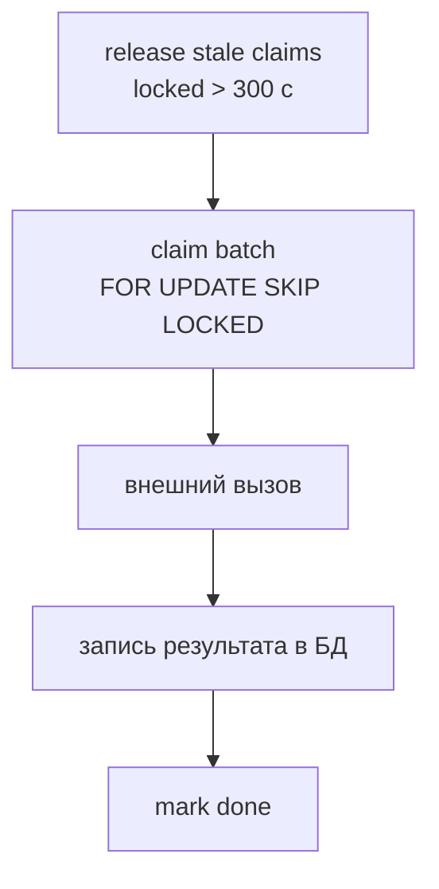
```mermaid
flowchart TB
    S["release stale claims<br/>locked > 300 c"] --> CL["claim batch<br/>FOR UPDATE SKIP LOCKED"] --> EX["внешний вызов"] --> W["запись результата в БД"] --> DN["mark done"]
```

Состояния строки:

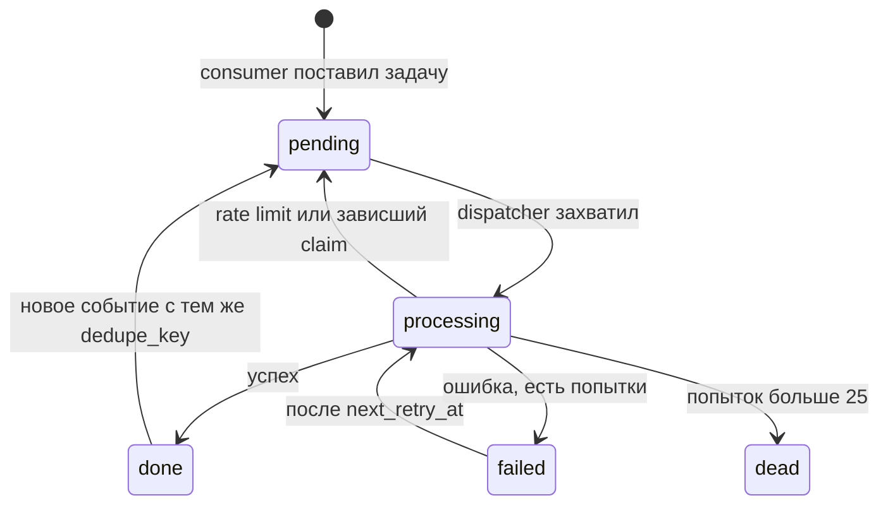
```mermaid
stateDiagram-v2
    [*] --> pending: consumer поставил задачу
    pending --> processing: dispatcher захватил
    processing --> done: успех
    processing --> failed: ошибка, есть попытки
    failed --> processing: после next_retry_at
    processing --> dead: попыток больше 25
    processing --> pending: rate limit или зависший claim
    done --> pending: новое событие с тем же dedupe_key
```

Обработка ошибок (`external_dispatcher_worker.py:234-267`):

| Ошибка | Действие | Расход попытки |
|---|---|---|
| `TeycaRateLimitBusyError` | `defer`: `next_retry_at = now + wait_seconds` | нет |
| `ListmonkClientError`, `TeycaAPIError`, `httpx.HTTPError`, `RuntimeError` | `mark_retry` с экспоненциальным backoff; при 25 попытках → `dead` | да |
| Любая другая | **не перехватывается**, вылетает из `run_once`; строка висит в `processing` до reaper'а (300 с) | нет |

Многошаговая операция `merge_finalize` защищена от повторов внутри себя: после каждого
успешного вызова Teyca прогресс сохраняется флагами `bonus_done` / `key2_done` в payload
(`:444-460`). При повторе выполнится только незавершённый шаг.

Отдельная особенность: если при записи `listmonk_users` обнаружен дубликат
`subscriber_id` или email, ошибка перехватывается внутри (`:331-357`), задача всё равно
закрывается как `done`, но маппинг не обновлён — расхождение с Listmonk остаётся до
reconcile или ручного воркера.

---

## 7) Периодические сверки

### 7.1 consent-sync (каждые 60 с) — бонус за согласие

Зачем: CRM не знает, подтвердил ли клиент подписку. Источник истины — Listmonk, а webhook
от Listmonk сознательно не используется, вместо него опрос по закладке.

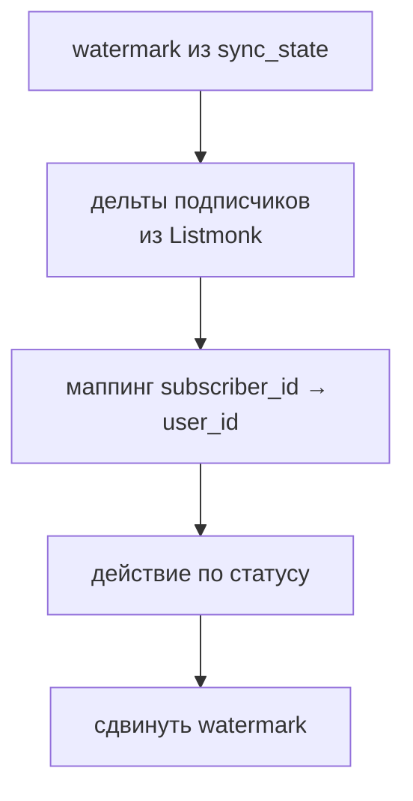
```mermaid
flowchart TB
    W["watermark из sync_state"] --> D["дельты подписчиков<br/>из Listmonk"] --> M["маппинг subscriber_id → user_id"] --> A["действие по статусу"] --> NW["сдвинуть watermark"]
```

| Статус подписчика | Действие |
|---|---|
| `blocked` / `blocklisted` или blocked в целевом списке | `key1 = blocked` в Teyca, `consent_pending = false` |
| не подтверждён | отметить проверку, `consent_pending` остаётся `true` |
| `confirmed` / `active` | начислить бонус (`POST /bonuses`), поставить `key1 = confirmed`, снять `consent_pending`, записать `consent_confirmed_at` |

Идемпотентность начисления — таблица `bonus_accrual_log`: ключ
`email_consent:{user_id}` плюс пошаговые флаги `bonus_done` / `key1_done`
(`consent_sync_worker.py:268`, `:404`, `:418`). Остаточный риск двойного начисления — падение
процесса между вызовом Teyca и сохранением флага.

Важная деталь: воркер обрабатывает **все** маппинги из дельт, без фильтра по
`consent_pending` (`consent_sync_worker.py:100-112`).

### 7.2 reconcile (каждые 300 с) — восстановление связи с Listmonk

Делает две несвязанные вещи за один запуск.

**Фаза 1 — новые/изменённые подписчики без маппинга.** Читает дельты по каждому `list_id`
и пытается связать подписчика с `user_id`:

| Способ связать | Условие |
|---|---|
| по `attributes.user_id` | значение валидно и такой пользователь есть в `users` |
| по email | email даёт **единственное** совпадение в `users` |
| не связывать | иначе — лог `unmapped` / `ambiguous` |

**Фаза 2 — consistency scan** (`listmonk_reconcile_worker.py:252-329`): круговой обход
`listmonk_users`, проверка, что подписчик всё ещё существует в Listmonk. Если исчез —
`restore_subscriber` создаёт нового, старая строка уходит в `listmonk_user_archive`.
Ошибка Listmonk внутри фазы делает `break`: остаток батча ждёт следующего тика.

### 7.3 email-repair — разбор дубликатов email (не запущен)

Зачем: два разных `user_id` пришли с одним email. Listmonk не даёт двух подписчиков на один
адрес, поэтому consumer не трогает Listmonk, а создаёт строку `email_repair_log(pending)`.

Как воркер её разбирает (`email_repair_worker.py:172-285`):

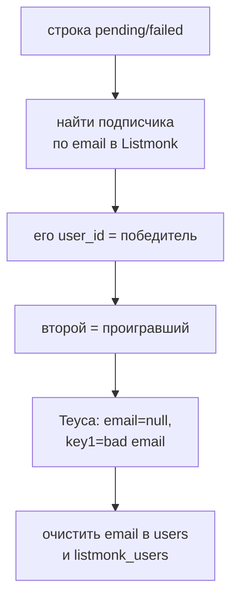
```mermaid
flowchart TB
    P["строка pending/failed"] --> S["найти подписчика<br/>по email в Listmonk"] --> WN["его user_id = победитель"] --> LS["второй = проигравший"] --> T["Teyca: email=null,<br/>key1=bad email"] --> CL["очистить email в users<br/>и listmonk_users"]
```

Если победителя не удалось определить однозначно (подписчика нет, маппинга нет, победитель
вне пары) — попытка засчитывается, строка уходит в `failed`, а после исчерпания попыток —
в `manual_review`.

**Этот воркер не запускается нигде**: ни в `compose.yaml`, ни в `Makefile`. Строки
`email_repair_log` создаются в трёх местах кода (`create_user.py:123`, `update_user.py:216`,
`external_dispatcher_worker.py:342`) и копятся без обработчика. Клиенты с дублирующимся
email остаются не синхронизированными до ручного запуска.

---

## 8) Воркеры, которые есть в коде, но не в расписании

| Модуль | Как запускается | Что делает |
|---|---|---|
| `run_email_repair.py` | **нигде** | разбор дубликатов email, см. 7.3 |
| `run_email_repair_backfill.py` | вручную | разовый backfill дубликатов |
| `run_listmonk_duplicate_subscriber.py` | вручную, `README.md:179` | чистка дублей `subscriber_id` |
| `run_listmonk_refresh_subscriber_ids.py` | `make listmonk-refresh-subscriber-ids[-apply]` | пересчёт `subscriber_id` по email |
| `run_legacy_snapshot_import.py` | `make legacy-import[-dry-run]` | импорт снапшота старой БД |
| `run_external_dispatcher.py` | `make external-dispatcher-once` | все операции outbox сразу (в compose разбит на три) |

---

## 9) Известные слабые места

Собрано по коду, без предположений о продакшене:

1. **Потеря события на входе.** Сбой RabbitMQ на `publish` = 500 клиенту, событие не
   сохранено нигде (`webhook.py:149`). Inbox-таблицы нет.
2. **Бесконечный requeue.** Любая ошибка, кроме lock-busy и 429, возвращает сообщение в
   очередь без задержки, а `x-max-delivery-count` по умолчанию выключен (`config.py:27`).
3. **`email_repair_log` без обработчика** — см. 7.3.
4. **Зависшие claim'ы в outbox.** Непойманное исключение оставляет строку в `processing`
   на 5 минут; вернуть её может только reaper (`external_dispatcher_worker.py:159-168`).
5. **Дубликаты закрываются как `done`** без обновления маппинга (`:331-357`).
6. **Двойное начисление в узком окне.** И `merge_finalize`, и consent-бонус защищены
   пошаговыми флагами, но падение между вызовом Teyca и сохранением флага не покрыто.
7. **Обрыв consistency scan** по `break` при первой ошибке Listmonk.
8. **Три копии одной формулы backoff**: `run_queue_consumers.py:548`, `:554`,
   `external_call_outbox.py:341`.
9. **Мёртвые сущности:** `QUEUE_MERGE`, клиенты Listmonk/Teyca в `ConsumersRunner`,
   недостижимая ветка 429 в consumer'е.
10. **Heartbeat в файловой системе контейнера** — снаружи о живости воркера судить нечем,
    кроме healthcheck'а самого контейнера.

---

## 10) Контракты внешних систем

**Teyca API:**

- `PUT /v1/{token}/passes/{user_id}` — **partial update**. Проверено 2026-03-18 на карте
  `user_id=5722735`: `PUT {"key6":"put-check"}` изменил только `key6`, остальное сохранилось.
- `POST /v1/{token}/passes/{user_id}/bonuses` — начисление операциями; используется и для
  merge-бонусов, и для consent-бонуса. Через `PUT` бонусы не начисляются.
- Клиент повторяет транзиентные ошибки и 5xx (`teyca_request_max_retries` = 2), таймаут HTTP
  жёстко зашит 15 с (`app/clients/teyca.py:299`).
- 429 поднимается как `TeycaAPIError.is_rate_limited`; в dispatcher'е это `defer`, в
  consumer'е — retry-очередь.
- Свой rate limiter: бюджетная таблица `teyca_call_budget` в Postgres (второй/минута/час/сутки),
  реальные лимиты 5/50/500/5000 (`teyca-sync-3al`). Исчерпание не блокирует воркер — вызов
  сразу падает `TeycaRateLimitBusyError`, claim откладывается (`defer`, с потолком попыток).

**Listmonk (только через Python SDK, прямые HTTP-вызовы запрещены):**

- `upsert_subscriber` без `subscriber_id` создаёт подписчика; при конфликте `409` /
  `subscribers_email_key` переключается на обновление по email (`listmonk.py:543-571`).
- Если сохранённый `subscriber_id` больше не существует, подписчик пересоздаётся по email
  (`:439-450`).
- При обновлении текущий статус подписчика передаётся явно (`:458-468`). Прежний риск
  авто-подтверждения подписки через `preconfirm_subscriptions=true` (issue `teyca-sync-b7j`)
  относится к внутренностям SDK и требует перепроверки на текущей версии.
- `list_id` берётся из `LISTMONK_LIST_IDS`, а не из CRM.

---

## 11) Логи по компонентам

Во всех логах обработки есть `trace_id`, `source_event_id`, `user_id`: в consumer'ах через
`bound_contextvars` (`run_queue_consumers.py:145-151`), в dispatcher'е через
`structlog.contextvars` (`external_dispatcher_worker.py:183-201`). У периодических воркеров
`trace_id` синтетический, например `consent-sync:{user_id}:{subscriber_id}` — с исходным
webhook-событием он не связан.

| Компонент | События |
|---|---|
| Приём | `webhook_received`, `webhook_invalid_json`, `webhook_validation_failed`, `webhook_client_disconnected`, `mq_published` |
| Consumers | `consumer_message_processing_started`, `consumer_message_acked`, `consumer_message_failed`, `consumer_message_requeued_user_lock_busy`, `consumer_message_dead_lettered_user_lock_busy`, `consumer_message_requeued_teyca_rate_limit`, `create_consumer_*`, `update_consumer_*`, `delete_consumer_processed`, `*_duplicate_email_scheduled` |
| Dispatcher | `external_dispatcher_metrics`, `external_dispatcher_no_pending_jobs`, `external_dispatcher_stale_claims_released`, `external_dispatcher_job_retry_scheduled`, `external_dispatcher_job_rate_limit_deferred`, `external_dispatcher_listmonk_upsert_done`, `external_dispatcher_listmonk_delete_done`, `external_dispatcher_invalid_email_block_done`, `external_dispatcher_merge_finalize_done`, `external_dispatcher_duplicate_*` |
| consent-sync | `consent_sync_metrics`, `consent_sync_list_processed`, `consent_sync_subscriber_not_mapped`, `consent_sync_subscriber_not_found` |
| reconcile | `listmonk_reconcile_metrics`, `listmonk_reconcile_list_processed`, `listmonk_reconcile_mapping_restored`, `listmonk_reconcile_unmapped`, `listmonk_reconcile_subscriber_restored`, `listmonk_reconcile_state_check_failed`, `listmonk_reconcile_restore_failed` |
| email-repair | `email_repair_metrics`, `email_repair_synced`, `email_repair_failed`, `email_repair_no_pending_rows` |
| Клиенты | `listmonk_upsert_subscriber_request`, `listmonk_upsert_subscriber_done`, `teyca_request_retry`, `teyca_rate_limiter_redis_failed` |
| Инфраструктура | `health_check_failed`, `service_heartbeat_write_failed`, `consumers_started` |

---

## 12) Что изменилось с версии документа от 2026-03-17

| Было описано | Есть в коде на 2026-07-30 |
|---|---|
| Consumer сам вызывает Listmonk SDK и Teyca API | Consumer пишет только в Postgres + outbox; внешние вызовы — в dispatcher |
| `merge_log` пишет consumer | `merge_log` пишет dispatcher после успешных вызовов Teyca |
| При невалидном email consumer сам ставит `key1=blocked` | Операция `teyca_block_invalid_email` через outbox |
| DELETE удаляет подписчика после коммита | Операция `listmonk_delete` через outbox |
| Retry/dead очередей нет | Три пары `-retry` / `-dead` с backoff по lock-busy и 429 |
| Outbox и dispatcher'ов нет | Таблица `external_call_outbox` + три dispatcher-контейнера на одном коде |
| Reconcile только по дельтам | Дельты + consistency scan с восстановлением подписчиков |
| Email-repair — периодический воркер, чистит нескольких проигравших и ставит `key6=bugs` | Не запускается вообще; разбирает пару «победитель/проигравший», ставит проигравшему `email=null`, `key1=bad email` |
| Merge-бонусы без идемпотентности | `merge_finalize` через `enqueue_once` + пошаговые флаги |
